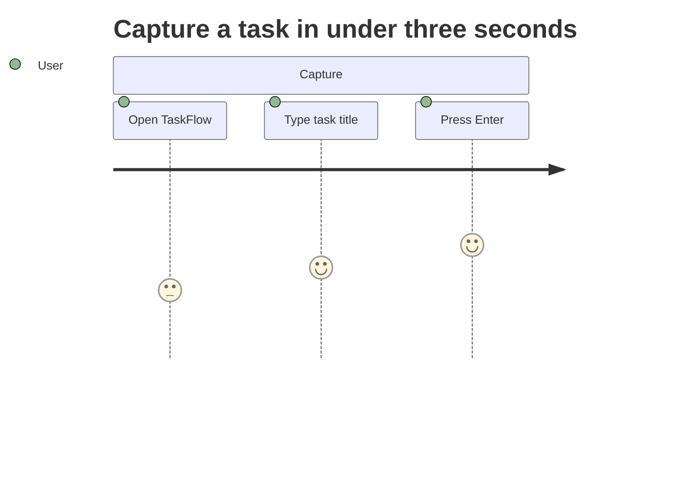

# DESIGN INTENT -- TaskFlow Demo

<!-- maintained-by: human (designer); Human (markers) classification since SEJA 2.8.3 -->

> Unified design intent for the TaskFlow demo project. Records working design intent (§0-§17), validated decisions with preserved rationale (`## Decisions`), and a changelog of marker flips and decision additions (`## CHANGELOG`).

---

## 0. Planned Changes

| Target Version | Change Summary | Motivation / Rationale |
|---|---|---|
| -- | Not applicable for demo | TaskFlow is a hello-world seed, not a versioned product |

---

## 1. Platform Purpose

TaskFlow is a lightweight task management application for individuals. Users create tasks, assign them to categories, and track completion status. The app runs entirely in the browser with no backend -- local storage persists data between sessions.

### Design Philosophy

Simplicity over features. Every screen should be understandable within five seconds. If a feature requires explanation, it is too complex for this project.

---

## 2. Entity Hierarchy

```
Category
  +-- Task
```

<!-- REQ-ENT-001 -->
### Category

Represents a grouping of related tasks (e.g., "Work", "Personal", "Errands").

- **Fields**: `id` (uuid), `name` (string, 1-30 chars), `color` (hex string)
- **Uniqueness**: Name must be unique (case-insensitive)
- **Default**: A "General" category exists on first launch and cannot be deleted

### Task

The atomic unit of work within a category.

- **Fields**: `id` (uuid), `title` (string, 1-120 chars), `description` (string, 0-500 chars, optional), `status` (enum: `todo` | `done`), `categoryId` (references Category.id), `createdAt` (ISO timestamp)
- **Scope**: Belongs to exactly one Category
- **Default status**: `todo` on creation
- **Soft delete**: Not supported -- tasks are permanently removed

---

## 3. Domain-Specific Concepts

### Status Toggle

A task's status flips between `todo` and `done` via a single click or keyboard action. There is no intermediate state (e.g., "in progress") by design -- this keeps the model binary and the UI simple.

---

## 4. Permission Model

Not applicable. TaskFlow is a single-user browser application with no authentication layer; all data lives in the current user's `localStorage` and every entity is owned implicitly by the active session.

---

## 5. Content Authoring & Attribution

Not applicable. Single-user application; no attribution tracking.

---

## 6. Content Import & Export

Not applicable. No import/export in the demo scope.

---

## 7. User Community & Localization

TaskFlow ships with a single `en-US` locale; i18n scaffolding is intentionally omitted from the demo.

---

## 8. User Experience Patterns (Domain-Driven)

The TaskFlow UX is driven entirely by the per-feature metacommunication intentions in §14. See §14 for the detailed table of designer intents per interaction.

---

## 9. Administrative Domain

Not applicable. No admin surface.

---

## 10. Validation Constants (Domain)

<!-- REQ-VAL-001 -->
| Constant | Value | Rationale |
|----------|-------|-----------|
| Category name length | 1-30 chars | Short enough to fit in sidebar labels |
| Task title length | 1-120 chars | One line in most viewports |
| Task description length | 0-500 chars | Optional detail without encouraging essays |
| Max categories | 20 | Prevents choice overload |
| Max tasks per category | 200 | Performance guard for DOM rendering |

---

# Part II -- Metacommunication

## 11. Global Metacommunication Vision

I have learned you want a fast, distraction-free way to track your tasks. I have therefore designed TaskFlow so that you can capture a task in seconds, group tasks into color-coded categories, and see at a glance what remains. I have kept the interface minimal on purpose -- there are no due dates, priorities, or collaboration features because I believe simplicity is what makes this tool useful for quick personal tracking.

---

## 12. Extended Metacommunication Template Guiding Questions

<!-- The TaskFlow demo omits the extended metacomm questionnaire. See §11 for the global vision and §14 for per-feature intentions. -->

---

## 13. Solution Representations

### US-001: Capture a task in under three seconds

- **Story:** As a focused solo planner, I want to add a task in under three seconds so that I can capture the thought before it escapes.
- **Goals:** Fast task capture while in flow
- **Problem Scenario:** I am deep in work, I remember something I need to do later, and every extra second I spend on capture is a second I lose from the work I am actually doing.
- **Acceptance Criteria:**
  - The task input is visible on first paint without scrolling or navigation
  - Pressing Enter in the input persists the task and clears the field for the next entry
  - The newly-created task appears at the top of the current category's list immediately after Enter

---

## 14. Per-Feature Metacommunication Intentions

<!-- REQ-MC-001 -->
| Feature / Flow | Designer Intent | Priority | Source | Last Synced |
|---|---|---|---|---|
| Task creation | I have placed the input field at the top of the list so you can add a task without navigating away. I pre-select the current category for you so creation requires only a title. | P0 | human | 2026-03-31 |
| Status toggle | I let you mark a task done with a single click or Space key because I want completion tracking to feel instant and effortless. | P0 | human | 2026-03-31 |
| Category filtering | I show categories as a sidebar list with color indicators so you can switch context with one click. I highlight the active category because I want you to always know which subset of tasks you are viewing. | P0 | human | 2026-03-31 |
| Category color | I let you pick a color for each category because I know visual distinction helps you scan the sidebar faster. | P1 | human | 2026-03-31 |
| Empty state | I show a friendly prompt when a category has no tasks because I want you to understand the app is working -- there is simply nothing here yet. | P1 | human | 2026-03-31 |
| Task deletion | I require a confirmation before deleting a task because deletion is permanent and I want to protect you from accidental loss. | P1 | human | 2026-03-31 |
| Keyboard navigation | I have made every action reachable via keyboard because I want you to be able to use TaskFlow without a mouse if you prefer. | P0 | human | 2026-03-31 |

---

## 15. Designed User Journeys

<!-- REQ-JM-001 -->
### JM-TB-001: Capture a task in under three seconds

- **Persona:** Focused solo planner
- **Solution Scenario:** US-001 (from §13 above)
- **Goal:** Add a task to the current category
- **Pre-conditions:** TaskFlow is open and a category is active

#### Steps

| # | Action | Touchpoint | User Emotion | Pain Point | Opportunity |
| - | ------ | ---------- | ------------ | ---------- | ----------- |
| 1 | Open TaskFlow | Sidebar | Neutral | None | Always show Today's count as greeting |
| 2 | Type task title into top input | Task input | Focused | Shift from reading mode to typing mode | Auto-focus input on app open |
| 3 | Press Enter | Task input | Satisfied | None | Echo the created task at the top of the list for 200ms |

#### Post-conditions / Outcomes

The task is persisted to `localStorage`, appears at the top of the active category's list, and the input field is cleared and re-focused for the next entry.

#### Mermaid Diagram



---

# Part III -- Delta from As-Coded

## 16. Conceptual Design Delta

### New (in as-intended but not in as-coded)

| Section | Element | Description |
|---|---|---|
| §2 | Category entity | New in as-intended; as-coded state does not yet exist for the demo |
| §2 | Task entity | New in as-intended; as-coded state does not yet exist for the demo |
| §3 | Status Toggle concept | New in as-intended; as-coded state does not yet exist for the demo |

### Changed (differs between as-coded and as-intended)

| Section | Element | As-Coded | As-Intended |
|---|---|---|---|
| -- | N/A for greenfield demo | -- | -- |

### Removed (in as-coded but not in as-intended)

| Section | Element | Reason for Removal |
|---|---|---|
| -- | N/A for greenfield demo | -- |

---

## 17. Metacommunication Delta

### New Intentions (not yet implemented)

| Feature / Flow | Designer Intent | Priority |
|---|---|---|
| Task creation | Input at top of list, category pre-selected | P0 |
| Status toggle | Single-click or Space key completion | P0 |
| Category filtering | Sidebar with color indicators and active highlight | P0 |
| Category color | User-selectable color per category | P1 |
| Empty state | Friendly prompt when no tasks exist | P1 |
| Task deletion | Confirmation before permanent delete | P1 |
| Keyboard navigation | All actions reachable via keyboard | P0 |

### Changed Intentions (implementation differs from intent)

| Feature / Flow | As-Coded | As-Intended | Priority |
|---|---|---|---|
| -- | N/A for greenfield demo | -- | -- |

### Deprecated Intentions (implemented but no longer desired)

| Feature / Flow | Current Implementation | Reason for Deprecation |
|---|---|---|
| -- | N/A for greenfield demo | -- |

---

## Decisions

<!-- TEMPLATE ENTRY - demonstrates the ADR shape; replace or delete before promoting a real decision -->

<!-- STATUS: proposed -->
### D-001: Binary task status (todo / done)

**Context**: TaskFlow needs a completion model. Options considered were binary (todo/done), three-state (todo/in-progress/done), and free-form status strings.

**Decision**: I chose a binary todo/done flip because the demo's design philosophy is simplicity over features, and every intermediate state I give you to toggle is another state I ask you to reason about.

**Consequences**: I lose the ability to model partial progress, but I gain a keyboard-friendly single-action completion interaction and a trivial visual state. I preserve the option to add a third state later by extending the `status` enum, at the cost of a future migration.

---

## CHANGELOG

<!-- Append-only. Format: YYYY-MM-DD | <id> | added|revised|revoked|superseded | plan-NNNNNN | <note> -->

2026-04-11 | D-001 | added | - | initial TaskFlow demo decision entry
