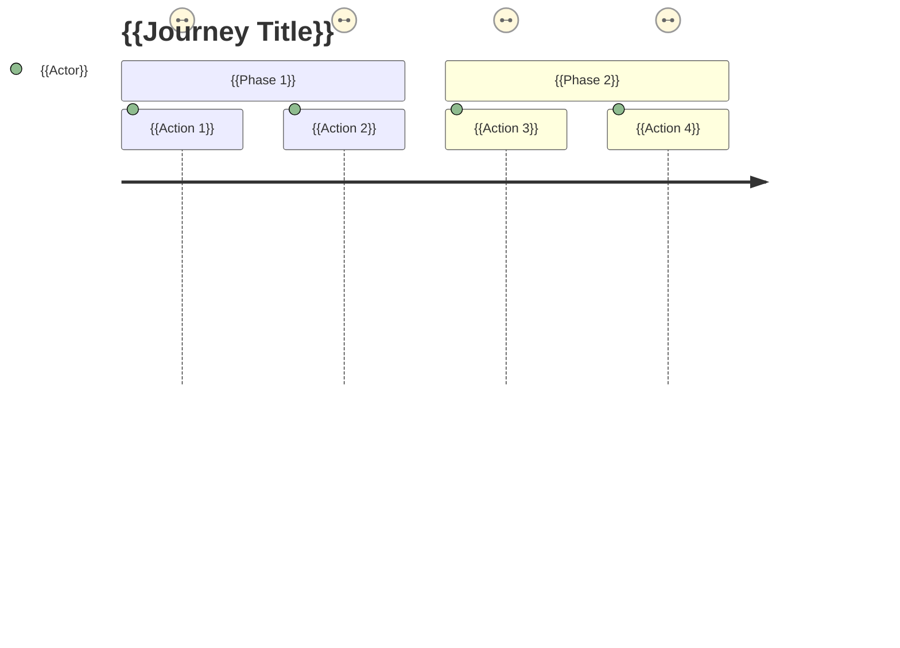

# TEMPLATE -- DESIGN INTENT TO-BE

<!-- maintained-by: human (designer) -->

> **How to use this template:** Copy this file to `project/design-intent-to-be.md` and document your product's conceptual design and metacommunication intent. This file combines what was formerly split between `conceptual-design-to-be.md` (domain model) and `metacomm-to-be.md` (designer-to-user message) into a single design intent document.
>
> This file reflects the **target design** -- what the system should be and communicate. Updated by the designer (human) or via `/explain spec-drift`.
>
> **Related files:**
> - `project/design-intent-established.md` -- processed design intent with preserved rationale (human-maintained, never agent-altered)
> - `project/conceptual-design-as-is.md` -- what is currently implemented (domain model, auto-maintained)
> - `project/metacomm-as-is.md` -- what the system currently communicates (auto-maintained)
> - `project/cd-as-is-changelog.md` -- versioned change history of the as-built design
> - `project/ux-research-new.md` -- fresh user research insights not yet processed into design
> - `project/ux-research-established.md` -- user research that has informed the current design
> - `project/journey-maps-as-is.md` -- implemented journey maps (agent-maintained)
> - `project/backend-standards.md` and `project/frontend-standards.md` -- implementation details
>
> **Preservation priorities** -- when moving processed entries to `project/design-intent-established.md`:
>
> | Section | Priority | Rationale |
> |---------|----------|-----------|
> | §4 Permission Model | P0 — must move | Permission rationale underpins security decisions |
> | §11 Global Metacommunication Vision | P0 — must move | Core semiotic engineering intent |
> | §13 Solution Representations | P0 — must move | Designer's intended user experience scenarios |
> | §14 Per-Feature Metacommunication Intentions | P0 — must move | Per-feature designer intent |
> | §1 Platform Purpose | P1 — should move | Foundational architectural intent |
> | §2 Entity Hierarchy | P1 — should move | Domain model rationale |
> | §3 Domain-Specific Concepts | P1 — should move | Unique domain decisions |
> | §8 UX Patterns (Domain-Driven) | P1 — should move | Domain-driven UX rationale |
> | §12 EMT Guiding Questions | P1 — should move | Ethical and analytical framing |
> | §15 Designed User Journeys | P1 — should move | Journey design rationale and validated flow designs |
> | §5 Content Authoring & Attribution | P2 — optional | Supporting content decisions |
> | §6 Content Import & Export | P2 — optional | Format decisions |
> | §7 User Community & Localization | P2 — optional | Target community context |
> | §9 Administrative Domain | P2 — optional | Admin constraints |
> | §10 Validation Constants | P2 — optional | Domain constants (also recorded in as-is) |

---

# Part I -- Conceptual Design

## 0. Planned Changes

> Summarize the high-level changes planned for the next version of the conceptual design.

| Target Version | Change Summary | Motivation / Rationale |
|---|---|---|
| {{vN}} | {{summary}} | {{why}} |

---

## 1. Platform Purpose
<!-- P1: should move to established -->

> Describe in 2-3 paragraphs: What does this platform do? Who is it for? What problem does it solve?

### Design Philosophy

> If the platform follows a specific design philosophy or methodology, document it here. This helps ensure all design decisions align with the platform's core intent.

---

## 2. Entity Hierarchy
<!-- P1: should move to established -->

> Map out the primary entities and their relationships. Use an ASCII tree to show containment/hierarchy:

```
{{TopLevelEntity}}
└── {{ChildEntity}}
    └── {{GrandchildEntity}}
        └── {{LeafEntity}}
```

### {{TopLevelEntity}}

> For each entity, document:
> - What it represents in the domain
> - Visibility/access rules
> - Ownership model
> - Uniqueness constraints
> - Soft delete behavior (if applicable)

### {{ChildEntity}}

> - Scope: Belongs to exactly one {{TopLevelEntity}}
> - Key domain rules

### {{LeafEntity}}

> - The atomic unit of content
> - Threading/nesting behavior (if applicable)
> - Content format (plain text, rich text, etc.)
> - Attachment support (if applicable)

---

## 3. Domain-Specific Concepts
<!-- P1: should move to established -->

> Document any domain-specific concepts that are unique to this application and not covered by standard CRUD patterns. For each concept:
> - What it is
> - Why it exists
> - How it relates to other entities
> - Any multilingual or localization requirements

---

## 4. Permission Model
<!-- P0: must move to established — permission rationale -->

> Define the permission levels for your application. Most applications have at least two levels: system-wide roles and resource-level access.

### System-Level Roles

| Role | Level | Capabilities |
|------|-------|-------------|
| {{Role1}} | {{level}} | {{description}} |
| {{Role2}} | {{level}} | {{description}} |
| {{Role3}} | {{level}} | {{description}} |

### Resource-Level Access

> If your application has resource-scoped permissions (e.g., per-group, per-project, per-organization), define them here:

| Access Level | Level | Capabilities |
|-------------|-------|-------------|
| {{Level1}} | {{value}} | {{description}} |
| {{Level2}} | {{value}} | {{description}} |

> **Rationale:** Explain why these specific permission levels exist and how they map to real-world user roles.

---

## 5. Content Authoring & Attribution
<!-- P2: optional move to established -->

> If your application supports content creation, document:
> - How authorship is tracked
> - Whether content can be attributed to non-system users
> - Mention/notification systems
> - Import/export attribution rules

---

## 6. Content Import & Export
<!-- P2: optional move to established -->

> If applicable, document supported formats:

### Import Formats

| Format | Source | Features |
|--------|--------|----------|
| {{format}} | {{source}} | {{features}} |

### Export Formats

| Format | Output | Use Case |
|--------|--------|----------|
| {{format}} | {{output}} | {{use_case}} |

---

## 7. User Community & Localization
<!-- P2: optional move to established -->

### Target Community

> Describe the primary user base: language, geography, domain expertise.

### Localization Design

| Aspect | Primary | Secondary |
|--------|---------|-----------|
| UI default language | {{PRIMARY_LOCALE}} | {{SECONDARY_LOCALE}} |
| Backend error default | {{BACKEND_DEFAULT}} | -- |

> Explain why these locale choices were made.

---

## 8. User Experience Patterns (Domain-Driven)
<!-- P1: should move to established -->

> Document the key UX patterns that are driven by domain requirements rather than generic UI conventions. For each pattern:
> - What the user sees/does
> - Why this pattern was chosen (domain rationale)
> - Any metacommunication intent

---

## 9. Administrative Domain
<!-- P2: optional move to established -->

### Activity Logging

> What operations are logged? What format?

### Backup & Restore

> Any domain-specific backup/restore requirements?

### Terms & Conditions

> Any domain-specific legal/compliance requirements?

---

## 10. Validation Constants (Domain)
<!-- P2: optional move to established -->

> Domain-driven validation limits. These should reflect real-world constraints, not arbitrary technical limits.

| Constant | Value | Domain Rationale |
|----------|-------|-----------------|
| {{field}} length | {{min}}--{{max}} chars | {{why}} |

> **Note:** These constants must be kept in sync between backend and frontend. See `project/security-checklists.md` Quick Reference for the technical mapping.

---

# Part II -- Metacommunication

> This part captures the designer's intent -- what the system should communicate to users. For the definition of metacommunication message, see `general/shared-definitions.md`.

## 11. Global Metacommunication Vision
<!-- P0: must move to established — core metacomm vision -->

> Write the full designer-to-user message as you intend it. **Phrasing: use "I" as the designer and "you" as the user -- never third-person or passive voice (see `general/shared-definitions.md` Phrasing rule).** Use the semiotic engineering frame: "Here is my understanding of who you are, what I've learned you want or need to do, in which preferred ways, and why. This is the system that I have therefore designed for you, and this is the way you can or should use it in order to fulfill a range of purposes that fall within this vision."

{{GLOBAL_METACOMM_VISION}}

---

## 12. Extended Metacommunication Template Guiding Questions
<!-- P1: should move to established -->

1. Analysis (understanding needs and defining requirements)
   1.1. What do I know or don't know about (all of) you and how?
   {{EMT_ANALYSIS_WHAT_I_KNOW_OR_DONT_KNOW_ABOUT_YOU_AND_HOW}}
   > For detailed persona profiles and problem scenarios, see `project/user-research-new.md` (fresh insights) and `project/user-research-established.md` (processed into current design).
   1.2. What do I know or don't know about affected others and how?
   {{EMT_ANALYSIS_WHAT_I_KNOW_OR_DONT_KNOW_ABOUT_AFFECTED_OTHERS_AND_HOW}}
   1.3. What do I know or don't know about the intended (and other anticipated) contexts of use?
   {{EMT_ANALYSIS_WHAT_I_KNOW_OR_DONT_KNOW_ABOUT_THE_INTENDED_AND_OTHER_ANTICIPATED_CONTEXTS_OF_USE}}
   1.4. *What ethical questions can be raised by what I have learned? Why?
   {{EMT_ANALYSIS_WHAT_ETHICAL_QUESTIONS_CAN_BE_RAISED_BY_WHAT_I_HAVE_LEARNED}}
2. Design
   2.1. What have I designed for you?
   {{EMT_DESIGN_WHAT_HAVE_I_DESIGNED_FOR_YOU}}
   2.2. Which of your goals have I designed the system to support?
   {{EMT_DESIGN_WHICH_OF_YOUR_GOALS_HAVE_I_DESIGNED_THE_SYSTEM_TO_SUPPORT}}
   2.3. In what situations/contexts do I intend/accept you will use the system to achieve each goal? Why?
   {{EMT_DESIGN_IN_WHAT_SITUATIONS_CONTEXTS_DO_I_INTEND_ACCEPT_YOU_WILL_USE_THE_SYSTEM_TO_ACHIEVE_EACH_GOAL}}
   > For detailed solution representations, see Section 13 below. For designed user journeys, see §15 below (Designed User Journeys).
   2.4. How should you use the system to achieve each goal, according to my design?
   {{EMT_DESIGN_HOW_SHOULD_YOU_USE_THE_SYSTEM_TO_ACHIEVE_EACH_GOAL}}
   > For step-by-step user journeys, see §15 below (Designed User Journeys).
   2.5. For what purposes do I not want you to use the system?
   {{EMT_DESIGN_FOR_WHAT_PURPOSES_DO_I_NOT_WANT_YOU_TO_USE_THE_SYSTEM}}
   2.6. *What ethical principles influenced my design decisions?
   {{EMT_DESIGN_WHAT_ETHICAL_PRINCIPLES_INFLUENCED_MY_DESIGN_DECISIONS}}
   2.7. *How is the system I designed for you aligned with those ethical considerations?
   {{EMT_DESIGN_HOW_IS_THE_SYSTEM_I_DESIGNED_FOR_YOU_ALIGNED_WITH_THOSE_ETHICAL_CONSIDERATIONS}}
3. Prototyping, implementation, and formative evaluation
   3.1. How have I built the system to support my design vision?
   {{EMT_PROTOTYPING_IMPLEMENTATION_AND_FORMATIVE_EVALUATION_HOW_HAVE_I_BUILT_THE_SYSTEM_TO_SUPPORT_MY_DESIGN_VISION}}
   3.2. What have I built into the system to prevent undesirable uses and consequences?
   {{EMT_PROTOTYPING_IMPLEMENTATION_AND_FORMATIVE_EVALUATION_WHAT_HAVE_I_BUILT_INTO_THE_SYSTEM_TO_PREVENT_UNDESIRABLE_USES_AND_CONSEQUENCES}}
   3.3. What have I built into the system to help identify and remedy unanticipated negative effects?
   {{EMT_PROTOTYPING_IMPLEMENTATION_AND_FORMATIVE_EVALUATION_WHAT_HAVE_I_BUILT_INTO_THE_SYSTEM_TO_HELP_IDENTIFY_AND_REMEDY_UNANTICIPATED_NEGATIVE_EFFECTS}}
   3.4. *What ethical scenarios have I used to evaluate the system?
   {{EMT_PROTOTYPING_IMPLEMENTATION_AND_FORMATIVE_EVALUATION_WHAT_ETHICAL_SCENARIOS_HAVE_I_USED_TO_EVALUATE_THE_SYSTEM}}
4. Continuous, post-deployment evaluation and monitoring
   4.1. How much of my vision is reflected in the system's actual use?
   {{EMT_CONTINUOUS_POST_DEPLOYMENT_EVALUATION_AND_MONITORING_HOW_MUCH_OF_MY_VISION_IS_REFLECTED_IN_THE_SYSTEMS_ACTUAL_USE}}
   4.2. What unanticipated uses have been made? By whom? Why?
   {{EMT_CONTINUOUS_POST_DEPLOYMENT_EVALUATION_AND_MONITORING_WHAT_UNANTICIPATED_USES_HAVE_BEEN_MADE_BY_WHO_WHY}}
   4.3. What anticipated and unanticipated effects have resulted from its use? Whom do they affect? Why?
   {{EMT_CONTINUOUS_POST_DEPLOYMENT_EVALUATION_AND_MONITORING_WHAT_ANTICIPATED_AND_UNANTICIPATED_EFFECTS_HAVE_RESULVED_FROM_ITS_USE_WHO_DO_THEY_AFFECT_WHY}}
   4.4. *What ethical issues need to be handled through system redesign, redevelopment, policy, or even decommissioning?
   {{EMT_CONTINUOUS_POST_DEPLOYMENT_EVALUATION_AND_MONITORING_WHAT_ETHICAL_ISSUES_NEED_TO_BE_HANDLED_THROUGH_SYSTEM_REDESIGN_REVOLUTIONARY_POLICY_OR_EVEN_DECOMMISSIONING}}

---

## 13. Solution Representations
<!-- P0: must move to established — solution representations -->

> Describe how the user achieves their goals *with* the designed system. These are design decisions -- they reference personas and goals from user research (`project/ux-research-new.md`, `project/ux-research-established.md`) and optionally reference problem scenarios. Choose the representation that best fits your team's workflow -- solution scenarios (narrative), user stories (role-goal-benefit), or both.

### Option A: Solution Scenarios

> Step-by-step narratives of the user's experience with the system. Best for complex flows where the sequence of interactions, emotions, and system responses matters.

#### {{SS-001}}: {{Solution Scenario Title}}

- **Persona:** {{PersonaName}} (from user research)
- **Goals:** {{G-001}}, {{G-002}} (from user research)
- **Problem Scenario:** {{PS-001}} (from user research, optional)
- **Setting:** {{where and when the user uses the system}}
- **Design Rationale:** {{optional -- why this solution approach was chosen over alternatives}}

{{2-3 paragraphs describing how the user achieves their goal with the system. Walk through the interaction step by step. What does the user see, do, and feel? How does the system respond? Write from the user's perspective.}}

### Option B: User Stories

> Concise role-goal-benefit statements. Best for backlog management, sprint planning, and when the interaction details are deferred to design/implementation.

#### {{US-001}}: {{User Story Title}}

- **Story:** As {{PersonaName}}, I want to {{action}} so that {{benefit}}.
- **Goals:** {{G-001}}, {{G-002}} (from user research)
- **Problem Scenario:** {{PS-001}} (from user research, optional)
- **Acceptance Criteria:**
  - {{criterion 1}}
  - {{criterion 2}}
  - {{criterion 3}}
- **Design Rationale:** {{optional -- why this solution approach was chosen over alternatives}}

> **Note:** Solution scenarios and user stories are complementary. A user story can reference a solution scenario for the detailed interaction narrative, and a solution scenario can be decomposed into user stories for implementation tracking. Use whichever combination serves your project.

---

## 14. Per-Feature Metacommunication Intentions
<!-- P0: must move to established — per-feature intents -->

> For each feature or interaction flow, document what the designer intends the system to communicate to the user. **Each intent must be phrased as "I ... for you / because you ..." -- see `general/shared-definitions.md` Phrasing rule.**

| Feature / Flow | Designer Intent | Priority | Source | Last Synced |
|---|---|---|---|---|
| {{feature}} | {{intent}} | {{P0 / P1 / P2}} | {{human / agent (spec-drift) / agent (metacomm)}} | {{YYYY-MM-DD}} |

---

## 15. Designed User Journeys
<!-- P1: should move to established -- journey design rationale and validated flows -->

> Document the intended step-by-step user experience for key flows. These are design
> decisions -- how you want users to experience the system.
>
> **One-directional flow:** Research findings in `project/ux-research-established.md §5`
> inform this section. This section does NOT flow back into the established research file.
>
> **Related files:**
>
> - `project/ux-research-established.md §5` -- discovered journeys (upstream evidence)
> - `project/journey-maps-as-is.md` -- implemented journeys (agent-maintained)
> - §13 Solution Representations (above) -- narrative counterparts
>
> **Lifecycle:** When a journey in this section has been implemented by a plan, mark it with
> `<!-- STATUS: IMPLEMENTED | plan-NNNNNN | YYYY-MM-DD -->`. When promoting to established,
> use `<!-- ESTABLISHED: ... -->` or run `/explain spec-drift --promote`.

---

### JM-TB-001: {{Journey Title}}

- **Persona:** {{PersonaName}} (from `project/ux-research-established.md §1`)
- **Solution Scenario:** {{SS-001}} (from §13 above, optional)
- **Informed by:** {{JM-E-NNN}} (ux-research-established.md §5, optional -- link to discovered journey if applicable)
- **Goal:** {{what the user wants to achieve}}
- **Pre-conditions:** {{what must be true before the journey starts}}

#### Steps

| # | Action | Touchpoint | User Emotion | Pain Point | Opportunity |
| - | ------ | ---------- | ------------ | ---------- | ----------- |
| 1 | {{what the user does}} | {{where they interact}} | {{how they feel}} | {{friction or frustration}} | {{design improvement}} |
| 2 | {{action}} | {{touchpoint}} | {{emotion}} | {{pain point}} | {{opportunity}} |
| 3 | {{action}} | {{touchpoint}} | {{emotion}} | {{pain point}} | {{opportunity}} |

#### Post-conditions / Outcomes

{{What is true after the journey completes. What has the user achieved?}}

#### Mermaid Diagram (optional)

> Use the Mermaid `journey` chart type for visual representation.



> Satisfaction scores: 1 = frustrated, 3 = neutral, 5 = delighted.

---

# Part III -- Delta from As-Is

## 16. Conceptual Design Delta

> Summary of what is new, changed, or removed compared to `project/conceptual-design-as-is.md`. Updated manually or via `/explain spec-drift`.

### New (in to-be but not in as-is)

| Section | Element | Description |
|---|---|---|
| {{section}} | {{element}} | {{description}} |

### Changed (differs between as-is and to-be)

| Section | Element | As-Is | To-Be |
|---|---|---|---|
| {{section}} | {{element}} | {{current}} | {{target}} |

### Removed (in as-is but not in to-be)

| Section | Element | Reason for Removal |
|---|---|---|
| {{section}} | {{element}} | {{reason}} |

---

## 17. Metacommunication Delta

> Summary of gaps between current implementation (`project/metacomm-as-is.md`) and intended design. Updated manually or via `/explain spec-drift`.

### New Intentions (not yet implemented)

| Feature / Flow | Designer Intent | Priority |
|---|---|---|
| {{feature}} | {{intent}} | {{P0 / P1 / P2}} |

### Changed Intentions (implementation differs from intent)

| Feature / Flow | Current (As-Is) | Intended (To-Be) | Priority |
|---|---|---|---|
| {{feature}} | {{current}} | {{intended}} | {{P0 / P1 / P2}} |

### Deprecated Intentions (implemented but no longer desired)

| Feature / Flow | Current Implementation | Reason for Deprecation |
|---|---|---|
| {{feature}} | {{current}} | {{reason}} |
