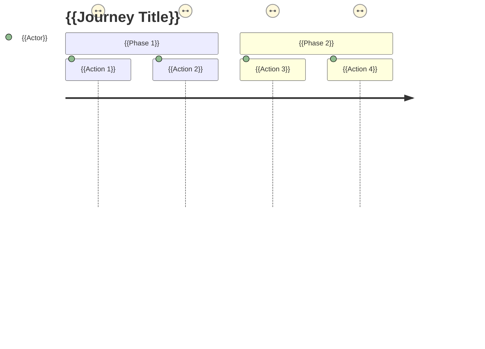

# TEMPLATE -- JOURNEY MAPS TO-BE

<!-- maintained-by: human (designer) -->

> **How to use this template:** Copy this file to `project/journey-maps.md` and document the intended step-by-step user experience for key flows. This is the **to-be** design -- how you want users to experience the system. For what is currently implemented, see `project/journey-maps-as-is.md`.
>
> Journey maps visualize the experience described in solution scenarios. For the narrative version, see `project/design-intent-to-be.md` Section 13.
>
> Journey maps can be represented as tables (below), Mermaid diagrams (example included), or external tools (FigJam, Miro). When using external tools, link to the diagram and summarize key findings here.
>
> Update per major feature. Owner: Product designer.

---

## {{Journey Title}}

- **Persona:** {{PersonaName}} (from `project/user-research-to-be.md`)
- **Solution Scenario:** {{SS-001}} (from `project/user-research-to-be.md` Section 3)
- **Goal:** {{what the user wants to achieve}}
- **Pre-conditions:** {{what must be true before the journey starts}}

### Steps

| # | Action | Touchpoint | User Emotion | Pain Point | Opportunity |
|---|--------|-----------|-------------|-----------|-------------|
| 1 | {{what the user does}} | {{where they interact}} | {{how they feel}} | {{friction or frustration}} | {{design improvement}} |
| 2 | {{action}} | {{touchpoint}} | {{emotion}} | {{pain point}} | {{opportunity}} |
| 3 | {{action}} | {{touchpoint}} | {{emotion}} | {{pain point}} | {{opportunity}} |

### Post-conditions / Outcomes

{{What is true after the journey completes. What has the user achieved?}}

### Mermaid Diagram (optional)

> Use the Mermaid `journey` chart type for visual representation. Example:

> Satisfaction scores: 1 = frustrated, 3 = neutral, 5 = delighted. Use scores to highlight emotional highs and lows in the journey.
