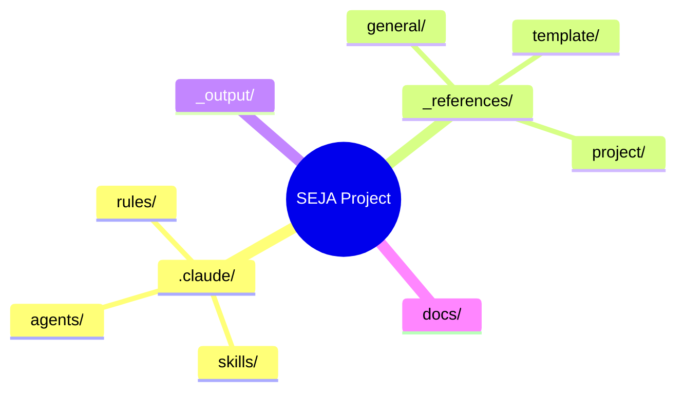

# Framework File Map

This page provides a complete inventory of the SEJA framework's directory structure, listing every major component, its location, and its purpose. Use this as a reference when navigating the codebase or understanding where a particular piece of configuration or logic lives.

For a conceptual introduction to how these components work together, see [Skills, Agents, and the Pipeline](../concepts/skills-agents-pipeline.md).

---

## Top-Level Structure



<details>
<summary>Text description of this diagram</summary>

- **SEJA Project** (root) contains four top-level directories:
  - **.claude/** -- contains `skills/`, `agents/`, and `rules/`
  - **_references/** -- contains `general/`, `template/`, and `project/`
  - **_output/** -- generated artifacts (no subdirectories shown)
  - **docs/** -- public-facing documentation (no subdirectories shown)

</details>

The framework distributes its components across three top-level directories inside a project: `.claude/` for executable logic (skills, agents, rules, scripts), `_references/` for declarative knowledge (general guidance, templates, project-specific configuration), and `_output/` for generated artifacts. The `docs/` directory holds public-facing documentation.

---

## `.claude/skills/` -- 15 Skills

The `skills/` directory contains 15 skills total: 13 user-facing skills and 2 internal lifecycle hooks. Each skill lives in its own subdirectory as a `SKILL.md` file with YAML frontmatter following the [agentskills.io](https://agentskills.io) specification.

### User-Facing Skills (13)

| Skill | Description |
|-------|-------------|
| `advise` | Answer questions about the codebase, architecture, or design decisions. Supports `--inventory` for cataloging and `--deep` for thorough analysis. |
| `check` | Run quality checks across 9 modes: validate, review, smoke, preflight, health, test-plan, docs, telemetry, and semiotic-inspection. |
| `communication` | Generate tailored communication material for a specific audience segment (evaluators, clients, end-users, academics). |
| `design` | Define or update project design -- stack, conventions, domain model, conceptual design, and standards. |
| `document` | Generate or update project documentation based on plan `Docs:` fields, auto-detection, or explicit type selection. |
| `explain` | Explain behavior, code, data model, architecture, or spec drift with visual diagrams and analogies. |
| `help` | Show contextual help, browse skills by category, or get details on a specific skill. |
| `implement` | Execute a previously generated plan. Supports manual (interactive) and auto (autonomous) modes. |
| `onboarding` | Generate tailored onboarding plans for new team members based on role family and expertise level. |
| `plan` | Create implementation plans for features, fixes, or refactors. Supports standard, `--light` (lightweight proposals), and `--roadmap` (full product roadmap) modes. |
| `qa-log` | Log the current Q&A session into a file for future reference. |
| `seed` | Copy the SEJA framework into a new or existing project, or create a workspace alongside an existing codebase. |
| `upgrade` | Upgrade framework files from the seed repo without touching project-specific files. |

### Internal Lifecycle Hooks (2)

| Skill | Description |
|-------|-------------|
| `pre-skill` | Runs before every user-facing skill. Loads references, logs briefs, evaluates context budget. |
| `post-skill` | Runs after every user-facing skill. Updates briefs, records telemetry, commits changes, suggests next steps. |

The `skills/` directory also contains a `skills-manifest.json` file (auto-generated by `generate_skills_manifest.py`) that provides a machine-readable index of all user-facing skills. Each entry records the skill name, a human-readable description, an argument hint showing accepted parameters, the functional category, and the current version:

```json
{
  "generated": "2026-04-06T23:22:24Z",
  "count": 13,
  "skills": [
    {
      "name": "advise",
      "description": "Answer questions about the codebase, architecture, or design decisions...",
      "argument_hint": "<question or topic> [--inventory <pattern>] [--deep]",
      "category": "analysis",
      "version": "1.2.0"
    },
    {
      "name": "check",
      "description": "Run quality checks: validation, code review, smoke tests, preflight...",
      "argument_hint": "<validate | review | smoke | preflight | health | ...> [--depth <light|standard|deep>] [scope]",
      "category": "analysis",
      "version": "1.0.0"
    }
  ]
}
```

---

## `.claude/agents/` -- 10 Agents

Agent prompt files define the behavior of subagents spawned by skills. They are organized into two functional roles.

### Evaluator Agents (7)

Evaluators review a single artifact type through a single lens. They produce advisory findings but do not modify project files directly.

| Agent | Reviews |
|-------|---------|
| `advisory-reviewer` | Design decisions and advisory reports |
| `code-reviewer` | Code diffs against quality perspectives |
| `council-debate` | Runs structured multi-perspective debates |
| `migration-validator` | Database migration correctness |
| `plan-reviewer` | Implementation plans against review perspectives |
| `standards-checker` | Aggregates validation script results |
| `test-runner` | Executes and evaluates test suites |

### Generator Agents (3)

Generators produce self-contained artifacts from well-defined inputs. They are invoked by thin-skill wrappers (the corresponding user-facing skill handles argument parsing, interactive prompts, and lifecycle hooks). Generator agents receive the project constitution as part of their prompt for trust boundary enforcement.

| Agent | Produces |
|-------|----------|
| `communication-generator` | Stakeholder communication material |
| `onboarding-generator` | Role-specific onboarding plans |
| `document-generator` | Project documentation (READMEs, ADRs, changelogs, etc.) |

A third role -- **executor agents** -- exists as a pattern but not as standalone prompt files. The `/implement` skill constructs executor agent prompts dynamically from plan step metadata when running in auto mode.

---

## `.claude/rules/` -- 7 Path-Scoped Rules

Rules are Markdown files that Claude auto-loads when editing files matching a specific glob pattern. The glob pattern is declared in the rule's YAML frontmatter under `paths:`. For example, `framework-structure.md` declares `paths: [".claude/**"]` and is automatically injected into context whenever Claude works on any file under `.claude/`.

| Rule File | Scope |
|-----------|-------|
| `framework-structure.md` | `.claude/**` -- framework component inventory and governance |
| `backend.md` | Backend source files -- coding standards and patterns |
| `frontend.md` | Frontend source files -- component and styling conventions |
| `tests.md` | Test files -- testing standards and coverage rules |
| `migrations.md` | Migration files -- database migration conventions |
| `i18n.md` | Internationalization files -- translation key conventions |
| `e2e.md` | End-to-end test files -- E2E testing patterns |

Rules enable automatic context injection without requiring skills to explicitly load them. When a developer (or an agent executing a plan) edits a backend file, the backend rule is loaded automatically, ensuring consistent standards enforcement.

---

## `.claude/skills/scripts/` -- 43 Validation Scripts

The `scripts/` directory contains Python scripts organized into several categories.

### Validation Checks (`check_*`)

These scripts perform automated quality checks. Each returns a non-zero exit code on failure. Key scripts include:

- `check_skill_spec.py` -- validates SKILL.md frontmatter against the agentskills.io specification
- `check_skill_system.py` -- verifies skill system integrity (manifest consistency, required fields)
- `check_conventions.py` -- validates `conventions.md` variable definitions
- `check_docs.py` -- plugin-based documentation consistency checker with 6 scanners (framework integrity, path liveness, env vars, command refs, terminology, structural-completeness)
- `check_secrets.py` -- scans for accidentally committed secrets
- `check_vuln_patterns.py` -- detects known vulnerability patterns in code
- `check_telemetry.py` -- validates telemetry data integrity
- `check_spec_conformance.py` -- validates specs against templates
- `check_design_output.py` -- verifies `/design` output completeness
- `check_plan_coverage.py` -- verifies requirement coverage in plans (REQ ID traceability)
- `check_version_changelog_sync.py` -- validates VERSION and CHANGELOG heading consistency

### Index Generators (`generate_*`)

These scripts produce or update index and summary files:

- `generate_briefs_index.py` -- creates the lightweight briefs index from the full briefs log
- `generate_macro_index.py` -- creates the global artifact index (`_output/INDEX.md`)
- `generate_skills_manifest.py` -- regenerates `skills-manifest.json` from SKILL.md frontmatter
- `generate_skill_graph.py` -- produces the skill transition graph
- `generate_skill_map.py` -- produces a visual skill map
- `generate_essential_perspectives_summary.py` -- auto-generates the Essential summary from perspective files
- `generate_cheatsheet.py` -- produces a quick-reference cheatsheet
- `generate_telemetry_report.py` -- produces telemetry analysis reports

### Runners and Orchestrators (`run_*`)

- `run_all_checks.py` -- CI-independent orchestrator that discovers and runs all `check_*` scripts with unified exit codes and JUnit XML output
- `run_all_tests.py` -- runs the project's test suites
- `run_preflight_fast.py` -- runs fast preflight checks before committing
- `run_migrations.py` -- executes database migrations

### Utilities

- `project_config.py` -- central module that parses `conventions.md` and supplies all scripts with project-specific paths and settings
- `reserve_id.py` -- reserves the next sequential ID for plans, advisories, and other artifacts
- `create_workspace.py` -- creates a workspace deployment from the foundational framework
- `upgrade_framework.py` -- upgrades framework files from a seed repo
- `smoke_test_core.py` -- core smoke testing logic
- `md_to_html.py` -- Markdown to HTML conversion
- `count_loc.py` -- lines-of-code counter
- `bump_version.py` -- bumps the framework version and updates CHANGELOG heading
- `backfill_qa_dates.py` -- backfills missing dates in QA log entries
- `migrate_to_global_ids.py` -- migrates artifacts to global ID scheme

The `scripts/tests/` subdirectory contains tests for the scripts themselves.

---

## `_references/general/` -- General References

This directory contains 22 top-level files plus three subdirectories. These files provide framework-wide guidance that applies across all projects.

### Key Top-Level Files

| File | Purpose |
|------|---------|
| `constraints.md` | Behavioral constraints, context management rules, pinned anchors |
| `permissions.md` | Agent permission boundaries and authorization model |
| `shared-definitions.md` | Shared vocabulary, lifecycle markers, file maintainer classifications |
| `threat-model.md` | STRIDE-lite threat model with vectors, trust boundaries, mitigations |
| `coding-standards.md` | Language-agnostic coding standards |
| `documentation-quality.md` | Diataxis classification, freshness policy, structural-completeness rules |
| `review-perspectives.md` | Overview of the 16-perspective review system with loading protocol |
| `review-perspectives-index.md` | Compact index (~600 tokens) for two-stage perspective loading |
| `skill-graph.md` | Skill transition graph for post-skill next-step suggestions |
| `recipes.md` | Common multi-skill workflow recipes |
| `getting-started.md` | Step-by-step onboarding guide for new SEJA users |
| `batch-execution-pattern.md` | Pattern for batch skill execution |
| `ci-integration.md` | Guide for integrating SEJA checks into CI pipelines |
| `script-manifest.md` | Registry of all validation scripts with metadata |
| `figma-make-integration.md` | Guide for Figma Make integration with SEJA workflows |
| `progress-file-pattern.md` | Pattern for tracking multi-step operation progress |

### Subdirectories

- `review-perspectives/` -- 16 perspective files (11 engineering + 5 design), each containing Essential (P0) and Deep-dive (P1-P4) review questions. Tags: SEC, PERF, DB, API, ARCH, DX, I18N, TEST, OPS, COMPAT, DATA, UX, A11Y, VIS, RESP, MICRO.
- `onboarding/` -- 8 files defining role families (BLD -- Builders, SHP -- Shapers, GRD -- Guardians) and expertise levels (L1 Newcomer through L5 Leader).
- `communication/` -- 5 files defining audience segments (EVL -- Evaluators, CLT -- Clients, USR -- End-users, ACD -- Academics) plus a Diataxis mapping guide.

---

## `_references/template/` -- 50 Templates

Templates are used by `/design` to generate project-specific files. They contain placeholder variables (e.g., `{{PROJECT_NAME}}`) that get substituted with values from `conventions.md` during project setup.

### Categories

- **Standards files** -- `backend-standards.md`, `frontend-standards.md`, `testing-standards.md`, `i18n-standards.md`, `ux-design-standards.md`, `graphic-ui-design-standards.md`, `security-checklists.md`
- **Rules** -- `rules-backend.md`, `rules-frontend.md`, `rules-tests.md`, `rules-migrations.md`, `rules-i18n.md`, `rules-e2e.md`
- **Agent specs** (`agent/`) -- 4 YAML files for agent-facing structured specifications: `constraints.yaml`, `entities.yaml`, `permissions.yaml`, `spec-checks.yaml`
- **Design artifacts** -- `conventions.md`, `constitution.md`, `conceptual-design-as-is.md`, `metacomm-as-is.md`, `design-intent-to-be.md`, `design-intent-established.md`, `journey-maps-as-is.md`, `ux-research-new.md`, `ux-research-established.md`, `cd-as-is-changelog.md`, `project-spec.md`, `questionnaire.md`, `roadmap-spec.md`, `communication-style.md`, `claude-md.md`
- **Agent configurations** -- `agents-code-reviewer.md`, `agents-plan-reviewer.md`, `agents-standards-checker.md`, `agents-test-runner.md`, `agents-migration-validator.md`
- **CI** (`ci/`) -- `github-actions-checks.yml` for GitHub Actions integration
- **Demo** (`demo/`) -- 5 pre-filled files for the `/seed --demo` hello-world experience: `conventions.md`, `constitution.md`, `conceptual-design-to-be.md`, `metacomm-to-be.md`, and `WALKTHROUGH.md`
- **Documentation templates** (`docs/`) -- 6 templates with `freshness` and `diataxis` classification metadata: `readme.md`, `contextual-help.md`, `api-reference.md`, `adr.md`, `help-center.md`, `changelog.md`
- **Smoke test registry** -- `smoke-test-registry.json`

---

## `_references/project/` -- Per-Project Files

These files are generated by `/design` and contain project-specific configuration and design artifacts. They live in `_references/project/` and are populated during project setup.

### Key Files and Maintainer Classification

| File | Maintained by | Description |
|------|---------------|-------------|
| `constitution.md` | Human | Immutable project principles. Never agent-altered. |
| `conventions.md` | Human / Agent | Primary configuration file with project-specific variables. |
| `design-intent-to-be.md` | Human | Target design intent -- fresh working document. Agents may propose changes via AskUserQuestion only. |
| `design-intent-established.md` | Human | Processed design intent with preserved rationale. Never agent-altered. |
| `conceptual-design-as-is.md` | Agent | As-built conceptual design. Auto-updated by post-skill. |
| `metacomm-as-is.md` | Agent | As-built metacommunication record. Auto-updated by post-skill. |
| `journey-maps-as-is.md` | Agent | Implemented user journeys. Auto-updated by post-skill. |
| `cd-as-is-changelog.md` | Agent | Changelog for the conceptual design as-is file. |
| `ux-research-new.md` | Human | Fresh UX research insights not yet processed into design. |
| `ux-research-established.md` | Human | Processed UX research. Append-only; agents must not modify. |
| `agent/*.yaml` | Agent | Agent-facing structured specs for automated validation. |
| Standards files | Human / Agent | Backend, frontend, testing, i18n, UX, and graphic design standards. |

The "Maintained by" classification controls which files agents may write to. "Human" files are read-only for agents. "Agent" files are auto-updated by the post-skill pipeline. "Human / Agent" files are seeded by `/design` but become human-owned after generation.

---

## `_output/` -- Generated Artifacts

All generated artifacts are written to `_output/` (configurable via `OUTPUT_DIR` in `conventions.md`). Subdirectories are created automatically as skills produce output.

| Subdirectory | Contents |
|--------------|----------|
| `plans/` | Implementation plans generated by `/plan` |
| `advisory-logs/` | Advisory reports from `/advise` |
| `proposals/` | Lightweight change proposals from `/plan --light` |
| `roadmaps/` | Product roadmaps from `/plan --roadmap` |
| `check-logs/` | Validation and review reports from `/check` |
| `qa-logs/` | QA session logs from `/qa-log` |
| `explained-behaviors/` | Behavior explanations from `/explain behavior` |
| `explained-code/` | Code explanations from `/explain code` |
| `explained-data-model/` | Data model explanations from `/explain data-model` |
| `explained-architecture/` | Architecture explanations from `/explain architecture` |
| `behavior-evolution/` | Behavior evolution reports from `/explain behavior-evolution` |
| `onboarding-plans/` | Onboarding plans from `/onboarding` |
| `communication/` | Communication material from `/communication` |
| `generated-scripts/` | Scripts produced during implementation |
| `inventories/` | Codebase inventories from `/advise --inventory` |
| `user-tests/` | User test plans from `/check test-plan` |
| `tmp/` | Temporary files and the session scratchpad |

Top-level files in `_output/` include:
- `briefs.md` -- full execution log of all skill invocations
- `briefs-index.md` -- lightweight one-line-per-entry index
- `INDEX.md` -- global artifact index across all subdirectories
- `telemetry.jsonl` -- JSON Lines telemetry data for skill invocations

The `briefs-index.md` file provides a scannable table with one row per skill invocation. Each row records the timestamp, skill name, a short summary, execution status, and the associated plan ID (if any):

```markdown
| Date | Skill | Brief | Status | Plan |
|------|-------|-------|--------|------|
| 2026-04-07 01:04 UTC | implement | Execute plan 000250: developer internals walkthrough | DONE | 000250 |
| 2026-04-07 00:49 UTC | plan | --roadmap Implement advisory-000246 recs R1-R9: SEJA docs coverage... | DONE |  |
| 2026-04-07 00:38 UTC | advise | Improve coverage of SEJA documentation in seja-public... | DONE |  |
```

The `INDEX.md` file catalogs every generated artifact across all subdirectories. Each row includes the artifact type, a sequential ID, title, lifecycle status, and a relative link to the file:

```markdown
| Date | Type | ID | Title | Status | File |
|------|------|----|-------|--------|------|
| 2026-04-07 00:49 UTC | Plan | 000248 | Designer mental model orientation page | DONE | [plan-000248-done-...](plans/plan-000248-done-designer-mental-model-orientation-page.md) |
| 2026-04-07 00:38 UTC | Advisory | 000246 | SEJA docs coverage for designers and devs | DONE | [advisory-000246-...](advisory-logs/advisory-000246-seja-docs-coverage-designers-devs.md) |
| 2026-04-07 00:03 UTC | Roadmap | 000245 | Version and changelog consistency | DONE | [roadmap-000245-...](roadmaps/roadmap-000245-version-changelog-consistency.md) |
```
