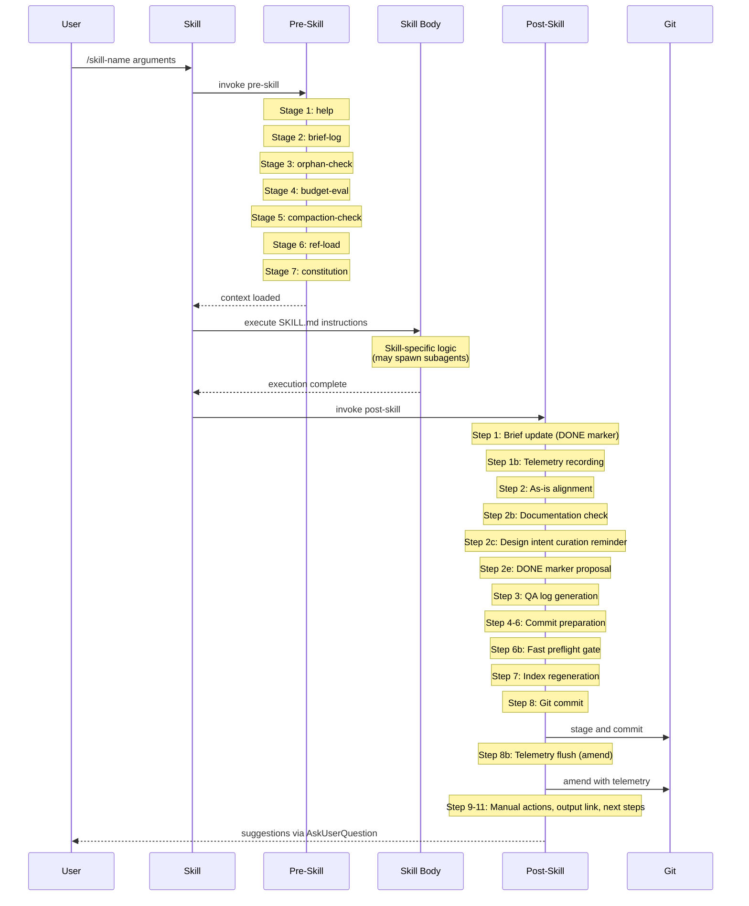

# Skill Execution Pipeline

Every SEJA skill invocation follows a three-phase lifecycle: **pre-skill** (setup and context loading), **skill body** (the skill's own logic), and **post-skill** (cleanup, recording, and commit). This page documents the full pipeline in detail.

For a conceptual introduction to skills and the pipeline, see [Skills, Agents, and the Pipeline](../concepts/skills-agents-pipeline.md).

---

## Pipeline Overview

---

## Phase 1: Pre-Skill Pipeline (7 Stages)

The pre-skill pipeline prepares the execution context. It runs as a sequence of 7 composable stages, each identified by a stage ID. Stages are classified as either **critical** (always run, abort on failure) or **non-critical** (error-isolated, skippable via `metadata.skip_stages`).

### Stage Catalog

| Stage ID | Name | Critical | Purpose |
|----------|------|----------|---------|
| `help` | Help interception | No | Check for `--help` flag and display Quick Guide |
| `brief-log` | Brief logging | Yes | Log invocation to the briefs file |
| `orphan-check` | Orphaned-brief detection | No | Detect orphaned STARTED entries from crashed sessions |
| `budget-eval` | Context budget evaluation | Yes | Determine context budget tier and load briefs |
| `compaction-check` | Context compaction warning | No | Warn when session has many recent invocations |
| `ref-load` | Reference file loading | Yes | Load mandatory and skill-specific reference files |
| `constitution` | Constitution injection | No | Inject project constitution if it exists |

### Stage Details

**help** -- Before any processing, checks whether the user passed `--help`. If so, extracts and displays the skill's `## Quick Guide` section (or falls back to the `description` frontmatter field) and stops. The remaining stages and the skill body do not execute.

**brief-log** -- Obtains the current UTC time via `date -u` and inserts a `STARTED | <datetime> | <skill-name> | <brief>` entry at the top of the briefs file. The file is saved immediately so the invocation is recorded even if the system crashes mid-execution.

**orphan-check** -- Reads the briefs index and scans for `STARTED` entries that have no matching `DONE`. These are likely from crashed or abandoned sessions. If orphans are found (excluding the entry just created), a warning lists the 5 most recent.

**budget-eval** -- Reads the calling skill's `metadata.context_budget` from its YAML frontmatter and loads briefs accordingly. Three tiers exist: `light` (skip all briefs and reference loading), `standard` (load briefs index only), and `heavy` (load full briefs with recency windowing -- first 50 entries -- plus the plan index). See [Context Strategy](context-strategy.md) for details on each tier.

**compaction-check** -- Counts STARTED entries from the last 2 hours. If the count exceeds 8, emits an advisory warning suggesting the user start a fresh conversation or persist key decisions to the session scratchpad. This stage is advisory-only and does not block execution.

**ref-load** -- Loads reference files in two groups. First, the mandatory references that every skill receives: `conventions.md`, `permissions.md`, and `constraints.md`. Second, skill-specific references using one of two modes determined by the skill's frontmatter:

- **Eager-only mode** (legacy): When the skill declares `metadata.references` but no `metadata.eager_references`, all listed references are loaded upfront.
- **Demand-pull mode** (two-tier): When the skill declares `metadata.eager_references`, those files are loaded upfront. The remaining entries in `metadata.references` become lazy -- they are listed in an "Available references" block so the skill body can request them on demand without paying the upfront context cost.

**constitution** -- Reads and injects `_references/project/constitution.md`. If the file does not exist (projects that predate the constitution feature), this stage is silently skipped.

### Skip Mechanism

Non-critical stages can be skipped per-skill by listing their stage IDs in `metadata.skip_stages` in the skill's YAML frontmatter. Critical stages (`brief-log`, `budget-eval`, `ref-load`) cannot be skipped -- if listed, they are silently ignored. Non-critical stages that encounter errors log a one-line warning and continue to the next stage rather than aborting the pipeline.

---

## Phase 2: Skill Body Execution

After pre-skill completes, the calling skill's `SKILL.md` body executes as instructions. The skill body has full access to the references loaded during pre-skill, plus any lazy references it can request on demand.

Skills may spawn subagents during execution. Evaluator agents (like `code-reviewer` or `plan-reviewer`) review artifacts and produce advisory findings. Generator agents (like `communication-generator` or `document-generator`) produce self-contained artifacts. Executor agents are constructed dynamically by `/implement` auto mode to execute individual plan steps in isolated context windows.

The skill body produces output artifacts in the appropriate `_output/` subdirectory and returns control to the post-skill pipeline.

---

## Phase 3: Post-Skill Pipeline

The post-skill pipeline handles cleanup, recording, and git commit. It executes as a sequence of numbered steps with checkpoint recovery -- if post-skill is interrupted, it can resume from the last completed step by reading `_output/.post-skill-checkpoint`.

### Step 0: Checkpoint Recovery

Checks for an existing checkpoint file. If one exists and matches the current invocation ID, resumes from the step after the checkpoint. If the IDs do not match, deletes the stale checkpoint and starts fresh.

### Step 1: Brief Update

Obtains the current UTC time and prepends `DONE | <datetime> |` to the matching STARTED entry in the briefs file. If a plan was generated, appends `| PLAN | <plan-id>` to the entry.

### Step 1b: Telemetry Recording

Prepares a telemetry record in memory with 11 fields: timestamp, skill name, invocation ID, duration in seconds, outcome (success/partial/failed), brief text, prefix scope, plan ID, error type, output file path, and context budget tier. This record is held in context until Step 8b writes it to disk with additional commit metadata.

### Step 2: As-Is Alignment

If the completed skill produced or executed a plan, updates the three as-is files to reflect what was implemented:

- **conceptual-design-as-is.md** -- adds, updates, or removes sections for entities, permissions, and patterns changed by the plan. Appends a changelog entry to `cd-as-is-changelog.md`.
- **metacomm-as-is.md** -- updates the per-feature metacommunication log with implemented intents. All metacomm text uses first-person ("I" as the designer, "you" as the user).
- **journey-maps-as-is.md** -- updates implementation status for journey map entries that correspond to steps completed by the plan.

### Step 2b: Documentation Check

For plans with non-N/A `Docs:` fields (always for FEATURE and REDESIGN plans, conditionally for FIX and CHORE), prompts the user about documentation updates. If accepted, runs `/document --plan <plan-id>`.

### Step 2c: Design Intent Curation Reminder

Outputs an informational reminder suggesting the user move processed entries from `design-intent-to-be.md` to `design-intent-established.md`. This is informational only -- the agent does not perform the move.

### Step 2e: DONE Marker Proposal

Scans all to-be files listed in the To-Be / As-Is Registry for sections that correspond to features implemented by the plan. Proposes adding `<!-- STATUS: IMPLEMENTED | plan-NNNNNN | YYYY-MM-DD -->` markers via AskUserQuestion. The user confirms or declines for each candidate.

### Step 3: QA Log Generation

Invokes the `/qa-log` skill to record the full Q&A session. The QA log is written to `_output/qa-logs/` with a filename derived from the skill invocation.

### Steps 4-6: Commit Preparation

- **Step 4**: Generates an appropriate commit message including the invocation ID.
- **Step 5**: Git-state safety check -- aborts if a rebase is in progress, merge conflicts exist, or HEAD is detached. Warns if committing directly to main/master.
- **Step 6**: Commit scope verification -- compares pre-staged files against the skill's expected output paths. Unexpected files trigger a warning instead of proceeding with the commit.

### Step 6b: Fast Preflight Gate

Runs `run_preflight_fast.py` to verify framework integrity before committing. If checks fail, the user is asked whether to proceed anyway. The gate is advisory rather than blocking because post-skill runs after potentially lengthy work and a hard block could lose progress. The pre-commit git hook provides the hard block.

### Step 7: Index Regeneration

Regenerates three index files to keep them current:

- `briefs-index.md` via `generate_briefs_index.py`
- `_output/INDEX.md` via `generate_macro_index.py`
- Cross-reference updates: if the produced artifact has a `source:` header, appends the new artifact's ID to the source artifact's `spawned:` field.

### Step 8: Git Commit

Stages all affected files (output artifacts, updated as-is files, regenerated indexes) and commits with the generated message.

### Step 8b: Telemetry Flush

Enriches the telemetry record with 3 additional fields from the commit: `git_commit_sha`, `files_changed`, and `parent_skill`. Appends the complete 14-field record as a single JSON line to `_output/telemetry.jsonl`, then amends the commit to include the telemetry file.

### Step 9: Manual Action Instructions

If the plan requires manual actions (database upgrades, environment configuration, service restarts), appends instructions to the plan file and informs the user.

### Step 10: Output Link

Outputs a link to the generated artifact within `_output/`.

### Step 11: Next-Step Suggestions

Reads `skill-graph.md` and looks up the completed skill in the transition graph. If follow-up skills are found, presents them via AskUserQuestion with numbered options. The user can select a skill to execute immediately or dismiss the suggestions.
