<!-- This file is generated by .claude/skills/scripts/generate_call_graph.py. Do not edit by hand. -->

# SEJA harness call graph

This is the live invocation topology: which skills call which scripts, which agents they delegate to, which other skills they orchestrate, and which references they load. The skill-orchestration overview also includes **suggests** edges (dashed, sourced from `general/skill-graph.md`) representing post-completion hints emitted by `/post-skill`; these are not runtime calls. See also:

- [`skill-map.md`](skill-map.md) -- post-completion *suggestions* (curatorial, what we recommend next).
- [`../reference/harness-reference.md`](../reference/harness-reference.md) -- flat catalog of every harness component.

Conditional edges (dashed stroke with a flag label, e.g. `--deep`) come from option-gated prose in a skill's source; they fire only when the named flag is passed.

## Skill orchestration

```mermaid
%%{init: {'theme': 'default', 'themeVariables': {'fontFamily': 'system-ui, -apple-system, Segoe UI, sans-serif'}}}%%
flowchart TD

    skill_check["/check"]
    skill_communicate["/communicate"]
    skill_design["/design"]
    skill_document["/document"]
    skill_explain["/explain"]
    skill_implement["/implement"]
    skill_onboard["/onboard"]
    skill_pending["/pending"]
    skill_plan["/plan"]
    skill_post_skill["/post-skill"]
    skill_pre_skill["/pre-skill"]
    skill_publish["/publish"]
    skill_qa_log["/qa-log"]
    skill_reflect["/reflect"]
    skill_research["/research"]
    skill_seja_setup["/seja-setup"]
    skill_internal_design_from_spec["_internal/design/from-spec"]
    skill_internal_design_interview["_internal/design/interview"]
    skill_internal_design_questionnaire["_internal/design/questionnaire"]
    skill_internal_design_update["_internal/design/update"]
    skill_internal_explain_spec_drift["_internal/explain/spec-drift"]
    skill_internal_plan_light["_internal/plan/light"]
    skill_internal_plan_roadmap["_internal/plan/roadmap"]
    skill_internal_plan_standard["_internal/plan/standard"]
    skill_internal_seja_setup_demo["_internal/seja-setup/demo"]
    skill_internal_seja_setup_here["_internal/seja-setup/here"]
    skill_internal_seja_setup_install["_internal/seja-setup/install"]
    skill_internal_seja_setup_upgrade["_internal/seja-setup/upgrade"]

    skill_internal_design_update --> skill_pre_skill
    skill_internal_explain_spec_drift --> skill_explain
    skill_internal_plan_light --> skill_post_skill
    skill_internal_plan_roadmap --> skill_post_skill
    skill_check --> skill_post_skill
    skill_check --> skill_pre_skill
    skill_communicate --> skill_post_skill
    skill_communicate --> skill_pre_skill
    skill_implement --> skill_post_skill
    skill_implement --> skill_pre_skill
    skill_onboard --> skill_post_skill
    skill_onboard --> skill_pre_skill
    skill_pending --> skill_pre_skill
    skill_plan --> skill_post_skill
    skill_plan --> skill_pre_skill
    skill_post_skill --> skill_seja_setup
    skill_publish --> skill_pre_skill
    skill_research --> skill_plan
    skill_research --> skill_post_skill
    skill_research --> skill_pre_skill
    skill_check -.->|Share the test plan with stakeholders?| skill_communicate
    skill_check -.->|Need to onboard someone to the project?| skill_onboard
    skill_check -.->|Check and address outstanding pending actions| skill_pending
    skill_check -.->|Want to plan fixes for the review findings?| skill_plan
    skill_check -.->|Preflight passed -- ready to cut a release?| skill_publish
    skill_check -.->|After quality checks, surface patterns across r...| skill_reflect
    skill_check -.->|Want to discuss usage patterns?| skill_research
    skill_communicate -.->|Need to onboard someone to the project?| skill_onboard
    skill_design -.-> skill_internal_design_from_spec
    skill_design -.-> skill_internal_design_interview
    skill_design -.-> skill_internal_design_questionnaire
    skill_design -.-> skill_internal_design_update
    skill_design -.->|Project configured -- generate a development ro...| skill_plan
    skill_document -.->|Validate documentation consistency?| skill_check
    skill_explain -.-> skill_internal_explain_spec_drift
    skill_explain -.->|Drift indicates intent has evolved -- update th...| skill_design
    skill_explain -.->|Address pending actions surfaced by the drift c...| skill_pending
    skill_explain -.->|Specs analyzed -- ready to plan next steps?| skill_plan
    skill_explain -.->|Have questions about what you just learned?| skill_research
    skill_implement -.->|All checks run by default unless --skip-checks ...| skill_check
    skill_implement -.->|Runs automatically via post-skill step 2b for F...| skill_document
    skill_implement -.->|Review pending actions created by this implemen...| skill_pending
    skill_implement -.->|Surface patterns across recent skill runs - non...| skill_reflect
    skill_onboard -.->|Want to generate stakeholder material as well?| skill_communicate
    skill_pending -.->|Next logical step after addressing pending cura...| skill_explain
    skill_pending -.->|Next logical step after reviewing pending revie...| skill_implement
    skill_plan -.-> skill_internal_plan_light
    skill_plan -.-> skill_internal_plan_roadmap
    skill_plan -.-> skill_internal_plan_standard
    skill_plan -.->|Ready to implement this plan?| skill_implement
    skill_publish -.->|Verify harness health after publishing| skill_check
    skill_qa_log -.->|Have more questions to explore?| skill_research
    skill_reflect -.->|Want to turn a surfaced pattern into new design...| skill_design
    skill_reflect -.->|Want to turn a surfaced pattern into new work?| skill_plan
    skill_reflect -.->|Want an assessment and recommendations on any p...| skill_research
    skill_research -.->|Recommendations indicate the design intent shou...| skill_design
    skill_research -.->|Want a deeper explanation of any of these?| skill_explain
    skill_research -.->|Want to turn these recommendations into a plan?| skill_plan
    skill_seja_setup -.-> skill_internal_seja_setup_demo
    skill_seja_setup -.-> skill_internal_seja_setup_here
    skill_seja_setup -.-> skill_internal_seja_setup_install
    skill_seja_setup -.-> skill_internal_seja_setup_upgrade
    skill_seja_setup -.->|Verify harness health after upgrading| skill_check
    skill_seja_setup -.->|New project: configure project design - stack, ...| skill_design
    skill_seja_setup -.->|Re-run spec drift after harness upgrade to catc...| skill_explain

    classDef analysis fill:#d4efd4,stroke:#74b874,color:#2d5a2d
    classDef utility fill:#e6e6e6,stroke:#a8a8a8,color:#404040
    classDef setup fill:#e3d6f0,stroke:#9b7fc7,color:#4a2f6b
    classDef planning fill:#b8d5f2,stroke:#6da3d4,color:#1e3a5f
    classDef lifecycle fill:#f5e1d6,stroke:#c28b6a,color:#5c2e1b
    classDef skill_internal fill:#e8f0f9,stroke:#6da3d4,stroke-dasharray:3 2,color:#1e3a5f
    class skill_check,skill_explain,skill_research analysis
    class skill_communicate,skill_document,skill_onboard,skill_pending,skill_publish,skill_qa_log,skill_reflect utility
    class skill_design,skill_seja_setup setup
    class skill_implement,skill_plan planning
    class skill_post_skill,skill_pre_skill lifecycle
    class skill_internal_design_from_spec,skill_internal_design_interview,skill_internal_design_questionnaire,skill_internal_design_update,skill_internal_explain_spec_drift,skill_internal_plan_light,skill_internal_plan_roadmap,skill_internal_plan_standard,skill_internal_seja_setup_demo,skill_internal_seja_setup_here,skill_internal_seja_setup_install,skill_internal_seja_setup_upgrade skill_internal
```

## Skill invocations

```mermaid
%%{init: {'theme': 'default', 'themeVariables': {'fontFamily': 'system-ui, -apple-system, Segoe UI, sans-serif'}}}%%
flowchart LR

    agent_architecture_explainer["architecture-explainer"]
    agent_code_reviewer["code-reviewer"]
    agent_communication_generator["communication-generator"]
    agent_council_debate["council-debate"]
    agent_document_generator["document-generator"]
    agent_evolution_explainer["evolution-explainer"]
    agent_explanation_generator["explanation-generator"]
    agent_harness_health_evaluator["harness-health-evaluator"]
    agent_migration_validator["migration-validator"]
    agent_onboarding_generator["onboarding-generator"]
    agent_research_reviewer["research-reviewer"]
    agent_semiotic_inspector["semiotic-inspector"]
    agent_standards_checker["standards-checker"]
    agent_test_plan_generator["test-plan-generator"]
    agent_test_runner["test-runner"]
    script_apply_marker_py["apply_marker.py"]
    script_check_docs_py["check_docs.py"]
    script_check_git_freshness_py["check_git_freshness.py"]
    script_check_human_markers_only_py["check_human_markers_only.py"]
    script_check_spec_conformance_py["check_spec_conformance.py"]
    script_detect_setup_state_py["detect_setup_state.py"]
    script_generate_briefs_index_py["generate_briefs_index.py"]
    script_generate_decision_digest_py["generate_decision_digest.py"]
    script_generate_macro_index_py["generate_macro_index.py"]
    script_generate_reflection_report_py["generate_reflection_report.py"]
    script_generate_skill_map_py["generate_skill_map.py"]
    script_generate_telemetry_report_py["generate_telemetry_report.py"]
    script_pending_py["pending.py"]
    script_reserve_id_py["reserve_id.py"]
    script_run_preflight_fast_py["run_preflight_fast.py"]
    script_summarize_artifacts_py["summarize_artifacts.py"]
    skill_check["/check"]
    skill_communicate["/communicate"]
    skill_document["/document"]
    skill_explain["/explain"]
    skill_help["/help"]
    skill_implement["/implement"]
    skill_onboard["/onboard"]
    skill_pending["/pending"]
    skill_plan["/plan"]
    skill_post_skill["/post-skill"]
    skill_pre_skill["/pre-skill"]
    skill_qa_log["/qa-log"]
    skill_reflect["/reflect"]
    skill_research["/research"]
    skill_seja_setup["/seja-setup"]

    skill_check --> agent_code_reviewer
    skill_check --> agent_harness_health_evaluator
    skill_check --> agent_migration_validator
    skill_check --> agent_semiotic_inspector
    skill_check --> agent_standards_checker
    skill_check --> agent_test_plan_generator
    skill_check --> agent_test_runner
    skill_check --> script_check_docs_py
    skill_check --> script_check_git_freshness_py
    skill_check --> script_check_spec_conformance_py
    skill_check --> script_generate_telemetry_report_py
    skill_check --> script_reserve_id_py
    skill_communicate --> agent_communication_generator
    skill_communicate --> script_reserve_id_py
    skill_document --> agent_document_generator
    skill_explain --> agent_architecture_explainer
    skill_explain --> agent_evolution_explainer
    skill_explain --> agent_explanation_generator
    skill_explain --> script_reserve_id_py
    skill_help --> script_generate_skill_map_py
    skill_implement --> agent_test_runner
    skill_implement --> script_generate_macro_index_py
    skill_implement --> script_pending_py
    skill_onboard --> agent_onboarding_generator
    skill_onboard --> script_reserve_id_py
    skill_pending --> script_apply_marker_py
    skill_pending --> script_pending_py
    skill_plan --> script_reserve_id_py
    skill_post_skill --> script_apply_marker_py
    skill_post_skill --> script_check_human_markers_only_py
    skill_post_skill --> script_generate_briefs_index_py
    skill_post_skill --> script_generate_decision_digest_py
    skill_post_skill --> script_generate_macro_index_py
    skill_post_skill --> script_pending_py
    skill_post_skill --> script_run_preflight_fast_py
    skill_pre_skill --> script_generate_briefs_index_py
    skill_pre_skill --> script_pending_py
    skill_qa_log --> script_reserve_id_py
    skill_reflect --> script_generate_reflection_report_py
    skill_reflect --> script_reserve_id_py
    skill_reflect --> script_summarize_artifacts_py
    skill_research -->|--deep| agent_council_debate
    skill_research --> agent_research_reviewer
    skill_research --> script_apply_marker_py
    skill_research --> script_pending_py
    skill_research --> script_reserve_id_py
    skill_seja_setup -->|--here| script_detect_setup_state_py

    classDef agent fill:#e6d5ed,stroke:#a082b5,color:#3e2852
    classDef script fill:#d5e3ef,stroke:#7c9ab3,color:#2a3e52
    classDef analysis fill:#d4efd4,stroke:#74b874,color:#2d5a2d
    classDef utility fill:#e6e6e6,stroke:#a8a8a8,color:#404040
    classDef planning fill:#b8d5f2,stroke:#6da3d4,color:#1e3a5f
    classDef lifecycle fill:#f5e1d6,stroke:#c28b6a,color:#5c2e1b
    classDef setup fill:#e3d6f0,stroke:#9b7fc7,color:#4a2f6b
    class agent_architecture_explainer,agent_code_reviewer,agent_communication_generator,agent_council_debate,agent_document_generator,agent_evolution_explainer,agent_explanation_generator,agent_harness_health_evaluator,agent_migration_validator,agent_onboarding_generator,agent_research_reviewer,agent_semiotic_inspector,agent_standards_checker,agent_test_plan_generator,agent_test_runner agent
    class script_apply_marker_py,script_check_docs_py,script_check_git_freshness_py,script_check_human_markers_only_py,script_check_spec_conformance_py,script_detect_setup_state_py,script_generate_briefs_index_py,script_generate_decision_digest_py,script_generate_macro_index_py,script_generate_reflection_report_py,script_generate_skill_map_py,script_generate_telemetry_report_py,script_pending_py,script_reserve_id_py,script_run_preflight_fast_py,script_summarize_artifacts_py script
    class skill_check,skill_explain,skill_research analysis
    class skill_communicate,skill_document,skill_help,skill_onboard,skill_pending,skill_qa_log,skill_reflect utility
    class skill_implement,skill_plan planning
    class skill_post_skill,skill_pre_skill lifecycle
    class skill_seja_setup setup
```

## Skill reference loads

_Showing 80 of 270 edges. See the JSON for the full set._

## Reference cross-links

```mermaid
%%{init: {'theme': 'default', 'themeVariables': {'fontFamily': 'system-ui, -apple-system, Segoe UI, sans-serif'}}}%%
flowchart TD

    ref_general_constraints_md["constraints"]
    ref_general_designer_copy_voice_rationale_md["designer-copy-voice-rationale"]
    ref_general_designer_copy_voice_md["designer-copy-voice"]
    ref_general_harness_governance_md["harness-governance"]
    ref_general_permissions_md["permissions"]
    ref_general_report_conventions_md["report-conventions"]
    ref_general_review_log_template_md["review-log-template"]
    ref_general_review_perspectives_md["review-perspectives"]
    ref_general_review_perspectives_a11y_md["a11y"]
    ref_general_review_perspectives_arch_md["arch"]
    ref_general_review_perspectives_db_md["db"]
    ref_general_review_perspectives_dx_md["dx"]
    ref_general_review_perspectives_i18n_md["i18n"]
    ref_general_review_perspectives_resp_md["resp"]
    ref_general_review_perspectives_sec_md["sec"]
    ref_general_review_perspectives_test_md["test"]
    ref_general_review_perspectives_ux_md["ux"]
    ref_general_review_perspectives_vis_md["vis"]
    ref_general_shared_definitions_md["shared-definitions"]
    ref_template_agent_spec_checks_yaml["spec-checks.yaml"]
    ref_template_agents_code_reviewer_md["agents-code-reviewer"]
    ref_template_agents_plan_reviewer_md["agents-plan-reviewer"]
    ref_template_claude_md_md["claude-md"]
    ref_template_conventions_md["conventions"]
    ref_template_rules_backend_md["rules-backend"]
    ref_template_rules_e2e_md["rules-e2e"]
    ref_template_rules_frontend_md["rules-frontend"]
    ref_template_rules_i18n_md["rules-i18n"]
    ref_template_rules_migrations_md["rules-migrations"]
    ref_template_rules_tests_md["rules-tests"]

    ref_general_constraints_md --> ref_general_harness_governance_md
    ref_general_designer_copy_voice_rationale_md --> ref_general_designer_copy_voice_md
    ref_general_designer_copy_voice_rationale_md --> ref_general_harness_governance_md
    ref_general_designer_copy_voice_rationale_md --> ref_general_report_conventions_md
    ref_general_designer_copy_voice_md --> ref_general_harness_governance_md
    ref_general_designer_copy_voice_md --> ref_general_report_conventions_md
    ref_general_harness_governance_md --> ref_general_shared_definitions_md
    ref_general_harness_governance_md --> ref_template_conventions_md
    ref_general_permissions_md --> ref_general_shared_definitions_md
    ref_general_shared_definitions_md --> ref_general_harness_governance_md
    ref_template_agent_spec_checks_yaml --> ref_general_constraints_md
    ref_template_agent_spec_checks_yaml --> ref_general_permissions_md
    ref_template_agent_spec_checks_yaml --> ref_general_review_perspectives_md
    ref_template_agent_spec_checks_yaml --> ref_template_conventions_md
    ref_template_agents_code_reviewer_md --> ref_general_review_perspectives_md
    ref_template_agents_plan_reviewer_md --> ref_general_review_log_template_md
    ref_template_agents_plan_reviewer_md --> ref_general_review_perspectives_md
    ref_template_claude_md_md --> ref_general_constraints_md
    ref_template_claude_md_md --> ref_general_permissions_md
    ref_template_rules_backend_md --> ref_general_review_perspectives_arch_md
    ref_template_rules_backend_md --> ref_general_review_perspectives_db_md
    ref_template_rules_backend_md --> ref_general_review_perspectives_sec_md
    ref_template_rules_e2e_md --> ref_general_review_perspectives_a11y_md
    ref_template_rules_e2e_md --> ref_general_review_perspectives_test_md
    ref_template_rules_e2e_md --> ref_general_review_perspectives_ux_md
    ref_template_rules_frontend_md --> ref_general_review_perspectives_a11y_md
    ref_template_rules_frontend_md --> ref_general_review_perspectives_resp_md
    ref_template_rules_frontend_md --> ref_general_review_perspectives_ux_md
    ref_template_rules_frontend_md --> ref_general_review_perspectives_vis_md
    ref_template_rules_i18n_md --> ref_general_review_perspectives_i18n_md
    ref_template_rules_migrations_md --> ref_general_review_perspectives_db_md
    ref_template_rules_migrations_md --> ref_general_review_perspectives_sec_md
    ref_template_rules_tests_md --> ref_general_review_perspectives_dx_md
    ref_template_rules_tests_md --> ref_general_review_perspectives_test_md

    classDef ref_general fill:#cfe3cf,stroke:#7fa87f,color:#2d4a2d
    classDef ref_template fill:#d7cce8,stroke:#9687b5,color:#3e3566
    class ref_general_constraints_md,ref_general_designer_copy_voice_md,ref_general_designer_copy_voice_rationale_md,ref_general_harness_governance_md,ref_general_permissions_md,ref_general_report_conventions_md,ref_general_review_log_template_md,ref_general_review_perspectives_a11y_md,ref_general_review_perspectives_arch_md,ref_general_review_perspectives_db_md,ref_general_review_perspectives_dx_md,ref_general_review_perspectives_i18n_md,ref_general_review_perspectives_md,ref_general_review_perspectives_resp_md,ref_general_review_perspectives_sec_md,ref_general_review_perspectives_test_md,ref_general_review_perspectives_ux_md,ref_general_review_perspectives_vis_md,ref_general_shared_definitions_md ref_general
    class ref_template_agent_spec_checks_yaml,ref_template_agents_code_reviewer_md,ref_template_agents_plan_reviewer_md,ref_template_claude_md_md,ref_template_conventions_md,ref_template_rules_backend_md,ref_template_rules_e2e_md,ref_template_rules_frontend_md,ref_template_rules_i18n_md,ref_template_rules_migrations_md,ref_template_rules_tests_md ref_template
```

## Per-skill call trees

### /check

Calls scripts:
- `check_docs.py`
- `check_git_freshness.py`
- `check_spec_conformance.py`
- `generate_telemetry_report.py`
- `reserve_id.py`

Delegates to agents:
- `code-reviewer`
- `harness-health-evaluator`
- `migration-validator`
- `semiotic-inspector`
- `standards-checker`
- `test-plan-generator`
- `test-runner`

Orchestrates skills:
- `/post-skill`
- `/pre-skill`

Suggests after (from skill-graph.md):
- `/communicate` -- Share the test plan with stakeholders?
- `/onboard` -- Need to onboard someone to the project?
- `/pending` -- Check and address outstanding pending actions
- `/plan` -- Want to plan fixes for the review findings?
- `/publish` -- Preflight passed -- ready to cut a release?
- `/reflect` -- After quality checks, surface patterns across recent runs
- `/research` -- Want to discuss usage patterns?

Auto-loads rules (via path scope):
- `harness-structure` -- .claude/**

Lazy-loads refs:
- `general/report-conventions.md`
- `general/review-log-template.md`
- `general/review-perspectives.md`
- `general/review-perspectives-index.md`

Dynamically loads refs (via runtime argument):
- `general/review-perspectives/a11y.md` -- review-perspectives
- `general/review-perspectives/api.md` -- review-perspectives
- `general/review-perspectives/arch.md` -- review-perspectives
- `general/review-perspectives/compat.md` -- review-perspectives
- `general/review-perspectives/data.md` -- review-perspectives
- `general/review-perspectives/db.md` -- review-perspectives
- `general/review-perspectives/dx.md` -- review-perspectives
- `general/review-perspectives/i18n.md` -- review-perspectives
- `general/review-perspectives/micro.md` -- review-perspectives
- `general/review-perspectives/ops.md` -- review-perspectives
- `general/review-perspectives/perf.md` -- review-perspectives
- `general/review-perspectives/resp.md` -- review-perspectives
- `general/review-perspectives/sec.md` -- review-perspectives
- `general/review-perspectives/test.md` -- review-perspectives
- `general/review-perspectives/ux.md` -- review-perspectives
- `general/review-perspectives/vis.md` -- review-perspectives

### /communicate

Calls scripts:
- `reserve_id.py`

Delegates to agents:
- `communication-generator`

Orchestrates skills:
- `/post-skill`
- `/pre-skill`

Suggests after (from skill-graph.md):
- `/onboard` -- Need to onboard someone to the project?

Auto-loads rules (via path scope):
- `harness-structure` -- .claude/**

Lazy-loads refs:
- `general/communication.md`
- `general/report-conventions.md`
- `general/shared-definitions.md`

Dynamically loads refs (via runtime argument):
- `general/communication/academics.md` -- communication
- `general/communication/clients.md` -- communication
- `general/communication/diataxis-mapping.md` -- communication
- `general/communication/end-users.md` -- communication
- `general/communication/evaluators.md` -- communication

Reads refs (explicit in prose/code):
- `general/batch-execution-pattern.md`
- `general/communication/diataxis-mapping.md`

### /design

Dispatches to internal workers (inlined):
- `_internal/design/from-spec`
- `_internal/design/interview`
- `_internal/design/questionnaire`
- `_internal/design/update`

Suggests after (from skill-graph.md):
- `/plan` -- Project configured -- generate a development roadmap

Auto-loads rules (via path scope):
- `harness-structure` -- .claude/**

Lazy-loads refs:
- `general/report-conventions.md`
- `general/review-perspectives.md`
- `general/shared-definitions.md`

### /document

Delegates to agents:
- `document-generator`

Suggests after (from skill-graph.md):
- `/check` -- Validate documentation consistency?

Auto-loads rules (via path scope):
- `harness-structure` -- .claude/**

Lazy-loads refs:
- `general/documentation-quality.md`
- `general/report-conventions.md`

Reads refs (explicit in prose/code):
- `general/documentation-quality.md`

### /explain

Calls scripts:
- `reserve_id.py`

Delegates to agents:
- `architecture-explainer`
- `evolution-explainer`
- `explanation-generator`

Dispatches to internal workers (inlined):
- `_internal/explain/spec-drift`

Suggests after (from skill-graph.md):
- `/design` -- Drift indicates intent has evolved -- update the project design
- `/pending` -- Address pending actions surfaced by the drift check
- `/plan` -- Specs analyzed -- ready to plan next steps?
- `/research` -- Have questions about what you just learned?

Auto-loads rules (via path scope):
- `harness-structure` -- .claude/**

Eager-loads refs:
- `general/report-conventions.md`
- `general/shared-definitions.md`

Reads refs (explicit in prose/code):
- `general/report-conventions.md`

### /help

Calls scripts:
- `generate_skill_map.py`

Auto-loads rules (via path scope):
- `harness-structure` -- .claude/**

Reads refs (explicit in prose/code):
- `general/skill-graph.md`

### /implement

Calls scripts:
- `generate_macro_index.py`
- `pending.py`

Delegates to agents:
- `test-runner`

Orchestrates skills:
- `/post-skill`
- `/pre-skill`

Suggests after (from skill-graph.md):
- `/check` -- All checks run by default unless --skip-checks was used.
- `/document` -- Runs automatically via post-skill step 2b for FEATURE/REDESIGN plans and plans with non-N/A Docs: fields; edge stays informational for `--skip-docs` and standalone `/document` modes.
- `/pending` -- Review pending actions created by this implementation
- `/reflect` -- Surface patterns across recent skill runs (non-prescriptive)

Auto-loads rules (via path scope):
- `harness-structure` -- .claude/**

Eager-loads refs:
- `general/coding-standards.md`
- `general/report-conventions.md`

Lazy-loads refs:
- `general/review-perspectives.md`

Reads refs (explicit in prose/code):
- `general/coding-standards.md`

### /onboard

Calls scripts:
- `reserve_id.py`

Delegates to agents:
- `onboarding-generator`

Orchestrates skills:
- `/post-skill`
- `/pre-skill`

Suggests after (from skill-graph.md):
- `/communicate` -- Want to generate stakeholder material as well?

Auto-loads rules (via path scope):
- `harness-structure` -- .claude/**

Lazy-loads refs:
- `general/onboarding.md`
- `general/report-conventions.md`
- `general/shared-definitions.md`

Dynamically loads refs (via runtime argument):
- `general/onboarding/builders.md` -- onboarding
- `general/onboarding/guardians.md` -- onboarding
- `general/onboarding/l1-contributor.md` -- onboarding
- `general/onboarding/l2-expert.md` -- onboarding
- `general/onboarding/l3-leader.md` -- onboarding
- `general/onboarding/shapers.md` -- onboarding

Reads refs (explicit in prose/code):
- `general/batch-execution-pattern.md`

### /pending

Calls scripts:
- `apply_marker.py`
- `pending.py`

Orchestrates skills:
- `/pre-skill`

Suggests after (from skill-graph.md):
- `/explain` -- Next logical step after addressing pending curation items (generates a Decision proposal for promotion candidates)
- `/implement` -- Next logical step after reviewing pending review items

Auto-loads rules (via path scope):
- `harness-structure` -- .claude/**

Lazy-loads refs:
- `general/shared-definitions.md`

### /plan

Calls scripts:
- `reserve_id.py`

Orchestrates skills:
- `/post-skill`
- `/pre-skill`

Dispatches to internal workers (inlined):
- `_internal/plan/light`
- `_internal/plan/roadmap`
- `_internal/plan/standard`

Suggests after (from skill-graph.md):
- `/implement` -- Ready to implement this plan?

Auto-loads rules (via path scope):
- `harness-structure` -- .claude/**

Eager-loads refs:
- `general/coding-standards.md`
- `general/report-conventions.md`
- `general/review-perspectives-index.md`

Lazy-loads refs:
- `template/plan-step.md`
- `template/proposal.md`
- `general/review-log-template.md`
- `general/review-perspectives.md`
- `template/roadmap-summary.md`

Reads refs (explicit in prose/code):
- `template/proposal.md`
- `template/roadmap-summary.md`

### /post-skill

Calls scripts:
- `apply_marker.py`
- `check_human_markers_only.py`
- `generate_briefs_index.py`
- `generate_decision_digest.py`
- `generate_macro_index.py`
- `pending.py`
- `run_preflight_fast.py`

Orchestrates skills:
- `/seja-setup`

Auto-loads rules (via path scope):
- `harness-structure` -- .claude/**

Reads refs (explicit in prose/code):
- `general/constraints.md`
- `general/documentation-quality.md`
- `general/skill-graph.md`

### /pre-skill

Calls scripts:
- `generate_briefs_index.py`
- `pending.py`

Auto-loads rules (via path scope):
- `harness-structure` -- .claude/**

Reads refs (explicit in prose/code):
- `general/constraints.md`
- `template/conventions.md`
- `general/permissions.md`

### /publish

Orchestrates skills:
- `/pre-skill`

Suggests after (from skill-graph.md):
- `/check` -- Verify harness health after publishing

Auto-loads rules (via path scope):
- `harness-structure` -- .claude/**

### /qa-log

Calls scripts:
- `reserve_id.py`

Suggests after (from skill-graph.md):
- `/research` -- Have more questions to explore?

Auto-loads rules (via path scope):
- `harness-structure` -- .claude/**

### /reflect

Calls scripts:
- `generate_reflection_report.py`
- `reserve_id.py`
- `summarize_artifacts.py`

Suggests after (from skill-graph.md):
- `/design` -- Want to turn a surfaced pattern into new design intents?
- `/plan` -- Want to turn a surfaced pattern into new work?
- `/research` -- Want an assessment and recommendations on any pattern surfaced here?

Auto-loads rules (via path scope):
- `harness-structure` -- .claude/**

Eager-loads refs:
- `general/constraints.md`

Lazy-loads refs:
- `general/coding-standards.md`
- `general/shared-definitions.md`
- `general/skill-graph.md`

Reads refs (explicit in prose/code):
- `general/constraints.md`

### /research

Calls scripts:
- `apply_marker.py`
- `pending.py`
- `reserve_id.py`

Delegates to agents:
- `council-debate` (when: --deep)
- `research-reviewer`

Orchestrates skills:
- `/plan`
- `/post-skill`
- `/pre-skill`

Suggests after (from skill-graph.md):
- `/design` -- Recommendations indicate the design intent should change -- update the project design before planning implementation.
- `/explain` -- Want a deeper explanation of any of these?
- `/plan` -- Want to turn these recommendations into a plan?

Auto-loads rules (via path scope):
- `harness-structure` -- .claude/**

Lazy-loads refs:
- `template/docs/drr.md`
- `general/report-conventions.md`
- `general/review-perspectives.md`
- `general/shared-definitions.md`

Reads refs (explicit in prose/code):
- `general/report-conventions.md`

### /seja-setup

Calls scripts:
- `detect_setup_state.py` (when: --here)

Dispatches to internal workers (inlined):
- `_internal/seja-setup/demo`
- `_internal/seja-setup/here`
- `_internal/seja-setup/install`
- `_internal/seja-setup/upgrade`

Suggests after (from skill-graph.md):
- `/check` -- Verify harness health after upgrading
- `/design` -- New project: configure project design (stack, conventions, domain model) after setup
- `/explain` -- Re-run spec drift after harness upgrade to catch changed conventions

Auto-loads rules (via path scope):
- `harness-structure` -- .claude/**

Lazy-loads refs:
- `template/conventions.md`
- `template/questionnaire.md`
- `general/shared-definitions.md`

## Reverse indices

### Scripts: used by

| Script | Path | Used by |
|---|---|---|
| `apply_marker.py` | `.claude/skills/scripts/apply_marker.py` | `_internal/explain/spec-drift`, `/pending`, `/post-skill`, `/research` |
| `backfill_decision_digest.py` | `.claude/skills/scripts/backfill_decision_digest.py` | _(unused)_ |
| `backfill_open_plans.py` | `.claude/skills/scripts/backfill_open_plans.py` | _(unused)_ |
| `backfill_qa_dates.py` | `.claude/skills/scripts/backfill_qa_dates.py` | _(unused)_ |
| `bump_version.py` | `.claude/skills/scripts/bump_version.py` | _(unused)_ |
| `check_api_auth_decorators.py` | `.claude/skills/scripts/check_api_auth_decorators.py` | _(unused)_ |
| `check_api_contract_sync.py` | `.claude/skills/scripts/check_api_contract_sync.py` | _(unused)_ |
| `check_backend_test_coverage.py` | `.claude/skills/scripts/check_backend_test_coverage.py` | _(unused)_ |
| `check_changelog_append_only.py` | `.claude/skills/explain/check_changelog_append_only.py` | `run_preflight_fast.py` |
| `check_conventions.py` | `.claude/skills/scripts/check_conventions.py` | `run_preflight_fast.py` |
| `check_design_output.py` | `.claude/skills/scripts/check_design_output.py` | `run_preflight_fast.py` |
| `check_docs.py` | `.claude/skills/check/check_docs.py` | `run_preflight_fast.py`, `/check` |
| `check_frontend_test_coverage.py` | `.claude/skills/scripts/check_frontend_test_coverage.py` | _(unused)_ |
| `check_git_freshness.py` | `.claude/skills/check/check_git_freshness.py` | `/check` |
| `check_human_markers_only.py` | `.claude/skills/scripts/check_human_markers_only.py` | `run_preflight_fast.py`, `/post-skill` |
| `check_i18n_keys.py` | `.claude/skills/scripts/check_i18n_keys.py` | _(unused)_ |
| `check_migration_chain.py` | `.claude/skills/scripts/check_migration_chain.py` | _(unused)_ |
| `check_no_private_leaks.py` | `.claude/skills/scripts/check_no_private_leaks.py` | `run_preflight_fast.py` |
| `check_plan_coverage.py` | `.claude/skills/design/check_plan_coverage.py` | `run_preflight_fast.py`, `_internal/plan/roadmap`, `_internal/plan/standard` |
| `check_po_parity.py` | `.claude/skills/scripts/check_po_parity.py` | _(unused)_ |
| `check_route_coverage.py` | `.claude/skills/scripts/check_route_coverage.py` | _(unused)_ |
| `check_secrets.py` | `.claude/skills/design/check_secrets.py` | `run_preflight_fast.py`, `_internal/design/questionnaire` |
| `check_section_boundary_writes.py` | `.claude/skills/post-skill/check_section_boundary_writes.py` | `run_preflight_fast.py` |
| `check_skill_spec.py` | `.claude/skills/scripts/check_skill_spec.py` | `run_preflight_fast.py` |
| `check_skill_system.py` | `.claude/skills/scripts/check_skill_system.py` | `run_preflight_fast.py` |
| `check_spec_conformance.py` | `.claude/skills/check/check_spec_conformance.py` | `run_preflight_fast.py`, `/check` |
| `check_telemetry.py` | `.claude/skills/scripts/check_telemetry.py` | _(unused)_ |
| `check_unused_files.py` | `.claude/skills/scripts/check_unused_files.py` | _(unused)_ |
| `check_validation_constants_sync.py` | `.claude/skills/scripts/check_validation_constants_sync.py` | _(unused)_ |
| `check_version_changelog_sync.py` | `.claude/skills/scripts/check_version_changelog_sync.py` | `bump_version.py`, `run_preflight_fast.py` |
| `check_vuln_patterns.py` | `.claude/skills/scripts/check_vuln_patterns.py` | _(unused)_ |
| `count_loc.py` | `.claude/skills/scripts/count_loc.py` | _(unused)_ |
| `create_workspace.py` | `.claude/skills/scripts/create_workspace.py` | _(unused)_ |
| `detect_setup_state.py` | `.claude/skills/seja-setup/detect_setup_state.py` | `test_detect_setup_state.py`, `_internal/seja-setup/here`, `/seja-setup` |
| `generate_briefs_index.py` | `.claude/skills/scripts/generate_briefs_index.py` | `/post-skill`, `/pre-skill` |
| `generate_call_graph.py` | `.claude/skills/scripts/generate_call_graph.py` | `run_preflight_fast.py` |
| `generate_cheatsheet.py` | `.claude/skills/scripts/generate_cheatsheet.py` | _(unused)_ |
| `generate_decision_digest.py` | `.claude/skills/post-skill/generate_decision_digest.py` | `/post-skill` |
| `generate_essential_perspectives_summary.py` | `.claude/skills/scripts/generate_essential_perspectives_summary.py` | _(unused)_ |
| `generate_harness_reference.py` | `.claude/skills/scripts/generate_harness_reference.py` | `generate_perspectives_reference.py`, `run_preflight_fast.py` |
| `generate_macro_index.py` | `.claude/skills/scripts/generate_macro_index.py` | `migrate_to_global_ids.py`, `/implement`, `/post-skill` |
| `generate_perspectives_reference.py` | `.claude/skills/scripts/generate_perspectives_reference.py` | _(unused)_ |
| `generate_reflection_report.py` | `.claude/skills/reflect/generate_reflection_report.py` | `/reflect` |
| `generate_skill_graph.py` | `.claude/skills/scripts/generate_skill_graph.py` | `run_preflight_fast.py` |
| `generate_skill_map.py` | `.claude/skills/help/generate_skill_map.py` | `/help` |
| `generate_skills_manifest.py` | `.claude/skills/scripts/generate_skills_manifest.py` | `generate_skills_reference.py`, `run_preflight_fast.py` |
| `generate_skills_reference.py` | `.claude/skills/scripts/generate_skills_reference.py` | _(unused)_ |
| `generate_telemetry_report.py` | `.claude/skills/check/generate_telemetry_report.py` | `/check` |
| `human_markers_registry.py` | `.claude/skills/scripts/human_markers_registry.py` | `apply_marker.py`, `check_changelog_append_only.py`, `check_human_markers_only.py` |
| `load_quickguide.py` | `.claude/skills/scripts/load_quickguide.py` | `check_docs.py`, `generate_call_graph.py` |
| `md_to_html.py` | `.claude/skills/scripts/md_to_html.py` | _(unused)_ |
| `migrate_qa_logs_to_parent_dirs.py` | `.claude/skills/seja-setup/migrate_qa_logs_to_parent_dirs.py` | `_internal/seja-setup/upgrade` |
| `migrate_to_global_ids.py` | `.claude/skills/scripts/migrate_to_global_ids.py` | _(unused)_ |
| `pending.py` | `.claude/skills/scripts/pending.py` | `_internal/explain/spec-drift`, `_internal/plan/roadmap`, `/implement`, `/pending`, `/post-skill`, `/pre-skill`, `/research` |
| `project_config.py` | `.claude/skills/scripts/project_config.py` | `apply_marker.py`, `backfill_decision_digest.py`, `backfill_open_plans.py`, `backfill_qa_dates.py`, `check_api_auth_decorators.py`, `check_api_contract_sync.py`, `check_backend_test_coverage.py`, `check_conventions.py`, `check_docs.py`, `check_frontend_test_coverage.py`, `check_git_freshness.py`, `check_i18n_keys.py`, `check_migration_chain.py`, `check_no_private_leaks.py`, `check_po_parity.py`, `check_route_coverage.py`, `check_secrets.py`, `check_spec_conformance.py`, `check_telemetry.py`, `check_unused_files.py`, `check_validation_constants_sync.py`, `check_vuln_patterns.py`, `count_loc.py`, `generate_briefs_index.py`, `generate_decision_digest.py`, `generate_macro_index.py`, `generate_reflection_report.py`, `generate_skill_map.py`, `generate_telemetry_report.py`, `md_to_html.py`, `migrate_qa_logs_to_parent_dirs.py`, `migrate_to_global_ids.py`, `pending.py`, `reflect_stuck_loops.py`, `reserve_id.py`, `run_all_checks.py`, `run_all_tests.py`, `smoke_test_core.py`, `summarize_artifacts.py`, `upgrade_harness.py` |
| `reflect_decision_reversals.py` | `.claude/skills/reflect/reflect_decision_reversals.py` | `generate_reflection_report.py` |
| `reflect_duration_anomalies.py` | `.claude/skills/reflect/reflect_duration_anomalies.py` | `generate_reflection_report.py` |
| `reflect_revision_rate.py` | `.claude/skills/reflect/reflect_revision_rate.py` | `generate_reflection_report.py` |
| `reflect_sequence_mining.py` | `.claude/skills/reflect/reflect_sequence_mining.py` | `generate_reflection_report.py` |
| `reflect_stuck_loops.py` | `.claude/skills/reflect/reflect_stuck_loops.py` | `generate_reflection_report.py` |
| `reserve_id.py` | `.claude/skills/scripts/reserve_id.py` | `/check`, `/communicate`, `/explain`, `/onboard`, `/plan`, `/qa-log`, `/reflect`, `/research` |
| `resolve_seja_version.py` | `.claude/skills/seja-setup/resolve_seja_version.py` | `_internal/seja-setup/upgrade` |
| `run_all_checks.py` | `.claude/skills/scripts/run_all_checks.py` | _(unused)_ |
| `run_all_tests.py` | `.claude/skills/scripts/run_all_tests.py` | _(unused)_ |
| `run_migrations.py` | `.claude/skills/scripts/run_migrations.py` | `upgrade_harness.py` |
| `run_preflight_fast.py` | `.claude/skills/scripts/run_preflight_fast.py` | `/post-skill` |
| `scan_public_docs_for_filenames.py` | `.claude/skills/scripts/scan_public_docs_for_filenames.py` | `generate_harness_reference.py` |
| `smoke_test_core.py` | `.claude/skills/scripts/smoke_test_core.py` | _(unused)_ |
| `summarize_artifacts.py` | `.claude/skills/reflect/summarize_artifacts.py` | `/reflect` |
| `test_detect_setup_state.py` | `.claude/skills/seja-setup/test_detect_setup_state.py` | _(unused)_ |
| `upgrade_harness.py` | `.claude/skills/scripts/upgrade_harness.py` | `create_workspace.py`, `_internal/seja-setup/upgrade` |

### Agents: delegated by

| Agent | Path | Delegated by |
|---|---|---|
| `architecture-explainer` | `.claude/agents/architecture-explainer.md` | `/explain` |
| `code-reviewer` | `.claude/agents/code-reviewer.md` | `/check` |
| `communication-generator` | `.claude/agents/communication-generator.md` | `/communicate` |
| `council-debate` | `.claude/agents/council-debate.md` | `/research` |
| `document-generator` | `.claude/agents/document-generator.md` | `/document` |
| `evolution-explainer` | `.claude/agents/evolution-explainer.md` | `/explain` |
| `explanation-generator` | `.claude/agents/explanation-generator.md` | `/explain` |
| `harness-health-evaluator` | `.claude/agents/harness-health-evaluator.md` | `/check` |
| `migration-validator` | `.claude/agents/migration-validator.md` | `/check` |
| `onboarding-generator` | `.claude/agents/onboarding-generator.md` | `/onboard` |
| `plan-reviewer` | `.claude/agents/plan-reviewer.md` | `_internal/plan/standard` |
| `research-reviewer` | `.claude/agents/research-reviewer.md` | `/research` |
| `semiotic-inspector` | `.claude/agents/semiotic-inspector.md` | `/check` |
| `standards-checker` | `.claude/agents/standards-checker.md` | `/check` |
| `test-plan-generator` | `.claude/agents/test-plan-generator.md` | `/check` |
| `test-runner` | `.claude/agents/test-runner.md` | `/check`, `/implement` |

Text-only relationship list (accessibility fallback)

Edges grouped by type, each line showing `source -> target: label`.

### invokes

- `script:bump_version.py` -> `script:check_version_changelog_sync.py`:
- `script:generate_harness_reference.py` -> `script:scan_public_docs_for_filenames.py`:
- `script:migrate_to_global_ids.py` -> `script:generate_macro_index.py`:
- `script:run_preflight_fast.py` -> `script:check_changelog_append_only.py`:
- `script:run_preflight_fast.py` -> `script:check_conventions.py`:
- `script:run_preflight_fast.py` -> `script:check_design_output.py`:
- `script:run_preflight_fast.py` -> `script:check_docs.py`:
- `script:run_preflight_fast.py` -> `script:check_human_markers_only.py`:
- `script:run_preflight_fast.py` -> `script:check_no_private_leaks.py`:
- `script:run_preflight_fast.py` -> `script:check_plan_coverage.py`:
- `script:run_preflight_fast.py` -> `script:check_secrets.py`:
- `script:run_preflight_fast.py` -> `script:check_section_boundary_writes.py`:
- `script:run_preflight_fast.py` -> `script:check_skill_spec.py`:
- `script:run_preflight_fast.py` -> `script:check_skill_system.py`:
- `script:run_preflight_fast.py` -> `script:check_spec_conformance.py`:
- `script:run_preflight_fast.py` -> `script:check_version_changelog_sync.py`:
- `script:run_preflight_fast.py` -> `script:generate_call_graph.py`:
- `script:run_preflight_fast.py` -> `script:generate_harness_reference.py`:
- `script:run_preflight_fast.py` -> `script:generate_skill_graph.py`:
- `script:run_preflight_fast.py` -> `script:generate_skills_manifest.py`:
- `skill-internal:design/questionnaire` -> `script:check_secrets.py`:
- `skill-internal:explain/spec-drift` -> `script:apply_marker.py`:
- `skill-internal:explain/spec-drift` -> `script:pending.py`:
- `skill-internal:plan/roadmap` -> `script:check_plan_coverage.py`:
- `skill-internal:plan/roadmap` -> `script:pending.py`:
- `skill-internal:plan/standard` -> `script:check_plan_coverage.py`:
- `skill-internal:seja-setup/here` -> `script:detect_setup_state.py`:
- `skill-internal:seja-setup/upgrade` -> `script:migrate_qa_logs_to_parent_dirs.py`:
- `skill-internal:seja-setup/upgrade` -> `script:resolve_seja_version.py`:
- `skill-internal:seja-setup/upgrade` -> `script:upgrade_harness.py`:
- `skill:check` -> `script:check_docs.py`:
- `skill:check` -> `script:check_git_freshness.py`:
- `skill:check` -> `script:check_spec_conformance.py`:
- `skill:check` -> `script:generate_telemetry_report.py`:
- `skill:check` -> `script:reserve_id.py`:
- `skill:communicate` -> `script:reserve_id.py`:
- `skill:explain` -> `script:reserve_id.py`:
- `skill:help` -> `script:generate_skill_map.py`:
- `skill:implement` -> `script:generate_macro_index.py`:
- `skill:implement` -> `script:pending.py`:
- `skill:onboard` -> `script:reserve_id.py`:
- `skill:pending` -> `script:apply_marker.py`:
- `skill:pending` -> `script:pending.py`:
- `skill:plan` -> `script:reserve_id.py`:
- `skill:post-skill` -> `script:apply_marker.py`:
- `skill:post-skill` -> `script:check_human_markers_only.py`:
- `skill:post-skill` -> `script:generate_briefs_index.py`:
- `skill:post-skill` -> `script:generate_decision_digest.py`:
- `skill:post-skill` -> `script:generate_macro_index.py`:
- `skill:post-skill` -> `script:pending.py`:
- `skill:post-skill` -> `script:run_preflight_fast.py`:
- `skill:pre-skill` -> `script:generate_briefs_index.py`:
- `skill:pre-skill` -> `script:pending.py`:
- `skill:qa-log` -> `script:reserve_id.py`:
- `skill:reflect` -> `script:generate_reflection_report.py`:
- `skill:reflect` -> `script:reserve_id.py`:
- `skill:reflect` -> `script:summarize_artifacts.py`:
- `skill:research` -> `script:apply_marker.py`:
- `skill:research` -> `script:pending.py`:
- `skill:research` -> `script:reserve_id.py`:
- `skill:seja-setup` -> `script:detect_setup_state.py`: (when: --here)

### delegates

- `skill-internal:plan/standard` -> `agent:plan-reviewer`:
- `skill:check` -> `agent:code-reviewer`:
- `skill:check` -> `agent:harness-health-evaluator`:
- `skill:check` -> `agent:migration-validator`:
- `skill:check` -> `agent:semiotic-inspector`:
- `skill:check` -> `agent:standards-checker`:
- `skill:check` -> `agent:test-plan-generator`:
- `skill:check` -> `agent:test-runner`:
- `skill:communicate` -> `agent:communication-generator`:
- `skill:document` -> `agent:document-generator`:
- `skill:explain` -> `agent:architecture-explainer`:
- `skill:explain` -> `agent:evolution-explainer`:
- `skill:explain` -> `agent:explanation-generator`:
- `skill:implement` -> `agent:test-runner`:
- `skill:onboard` -> `agent:onboarding-generator`:
- `skill:research` -> `agent:council-debate`: (when: --deep)
- `skill:research` -> `agent:research-reviewer`:

### orchestrates

- `skill-internal:design/update` -> `skill:pre-skill`:
- `skill-internal:explain/spec-drift` -> `skill:explain`:
- `skill-internal:plan/light` -> `skill:post-skill`:
- `skill-internal:plan/roadmap` -> `skill:post-skill`:
- `skill:check` -> `skill:post-skill`:
- `skill:check` -> `skill:pre-skill`:
- `skill:communicate` -> `skill:post-skill`:
- `skill:communicate` -> `skill:pre-skill`:
- `skill:implement` -> `skill:post-skill`:
- `skill:implement` -> `skill:pre-skill`:
- `skill:onboard` -> `skill:post-skill`:
- `skill:onboard` -> `skill:pre-skill`:
- `skill:pending` -> `skill:pre-skill`:
- `skill:plan` -> `skill:post-skill`:
- `skill:plan` -> `skill:pre-skill`:
- `skill:post-skill` -> `skill:seja-setup`:
- `skill:publish` -> `skill:pre-skill`:
- `skill:research` -> `skill:plan`:
- `skill:research` -> `skill:post-skill`:
- `skill:research` -> `skill:pre-skill`:

### dispatches-inline

- `skill:design` -> `skill-internal:design/from-spec`:
- `skill:design` -> `skill-internal:design/interview`:
- `skill:design` -> `skill-internal:design/questionnaire`:
- `skill:design` -> `skill-internal:design/update`:
- `skill:explain` -> `skill-internal:explain/spec-drift`:
- `skill:plan` -> `skill-internal:plan/light`:
- `skill:plan` -> `skill-internal:plan/roadmap`:
- `skill:plan` -> `skill-internal:plan/standard`:
- `skill:seja-setup` -> `skill-internal:seja-setup/demo`:
- `skill:seja-setup` -> `skill-internal:seja-setup/here`:
- `skill:seja-setup` -> `skill-internal:seja-setup/install`:
- `skill:seja-setup` -> `skill-internal:seja-setup/upgrade`:

### suggests

- `skill:check` -> `skill:communicate`: Share the test plan with stakeholders?
- `skill:check` -> `skill:onboard`: Need to onboard someone to the project?
- `skill:check` -> `skill:pending`: Check and address outstanding pending actions
- `skill:check` -> `skill:plan`: Want to plan fixes for the review findings?
- `skill:check` -> `skill:publish`: Preflight passed -- ready to cut a release?
- `skill:check` -> `skill:reflect`: After quality checks, surface patterns across recent runs
- `skill:check` -> `skill:research`: Want to discuss usage patterns?
- `skill:communicate` -> `skill:onboard`: Need to onboard someone to the project?
- `skill:design` -> `skill:plan`: Project configured -- generate a development roadmap
- `skill:document` -> `skill:check`: Validate documentation consistency?
- `skill:explain` -> `skill:design`: Drift indicates intent has evolved -- update the project design
- `skill:explain` -> `skill:pending`: Address pending actions surfaced by the drift check
- `skill:explain` -> `skill:plan`: Specs analyzed -- ready to plan next steps?
- `skill:explain` -> `skill:research`: Have questions about what you just learned?
- `skill:implement` -> `skill:check`: All checks run by default unless --skip-checks was used.
- `skill:implement` -> `skill:document`: Runs automatically via post-skill step 2b for FEATURE/REDESIGN plans and plans with non-N/A Docs: fields; edge stays informational for `--skip-docs` and standalone `/document` modes.
- `skill:implement` -> `skill:pending`: Review pending actions created by this implementation
- `skill:implement` -> `skill:reflect`: Surface patterns across recent skill runs (non-prescriptive)
- `skill:onboard` -> `skill:communicate`: Want to generate stakeholder material as well?
- `skill:pending` -> `skill:explain`: Next logical step after addressing pending curation items (generates a Decision proposal for promotion candidates)
- `skill:pending` -> `skill:implement`: Next logical step after reviewing pending review items
- `skill:plan` -> `skill:implement`: Ready to implement this plan?
- `skill:publish` -> `skill:check`: Verify harness health after publishing
- `skill:qa-log` -> `skill:research`: Have more questions to explore?
- `skill:reflect` -> `skill:design`: Want to turn a surfaced pattern into new design intents?
- `skill:reflect` -> `skill:plan`: Want to turn a surfaced pattern into new work?
- `skill:reflect` -> `skill:research`: Want an assessment and recommendations on any pattern surfaced here?
- `skill:research` -> `skill:design`: Recommendations indicate the design intent should change -- update the project design before planning implementation.
- `skill:research` -> `skill:explain`: Want a deeper explanation of any of these?
- `skill:research` -> `skill:plan`: Want to turn these recommendations into a plan?
- `skill:seja-setup` -> `skill:check`: Verify harness health after upgrading
- `skill:seja-setup` -> `skill:design`: New project: configure project design (stack, conventions, domain model) after setup
- `skill:seja-setup` -> `skill:explain`: Re-run spec drift after harness upgrade to catch changed conventions

### auto-loads

- `skill:check` -> `rule:harness-structure`: .claude/**
- `skill:communicate` -> `rule:harness-structure`: .claude/**
- `skill:design` -> `rule:harness-structure`: .claude/**
- `skill:document` -> `rule:harness-structure`: .claude/**
- `skill:explain` -> `rule:harness-structure`: .claude/**
- `skill:help` -> `rule:harness-structure`: .claude/**
- `skill:implement` -> `rule:harness-structure`: .claude/**
- `skill:onboard` -> `rule:harness-structure`: .claude/**
- `skill:pending` -> `rule:harness-structure`: .claude/**
- `skill:plan` -> `rule:harness-structure`: .claude/**
- `skill:post-skill` -> `rule:harness-structure`: .claude/**
- `skill:pre-skill` -> `rule:harness-structure`: .claude/**
- `skill:publish` -> `rule:harness-structure`: .claude/**
- `skill:qa-log` -> `rule:harness-structure`: .claude/**
- `skill:reflect` -> `rule:harness-structure`: .claude/**
- `skill:research` -> `rule:harness-structure`: .claude/**
- `skill:seja-setup` -> `rule:harness-structure`: .claude/**

### eager-load

- `skill:explain` -> `ref-general:report-conventions.md`:
- `skill:explain` -> `ref-general:shared-definitions.md`:
- `skill:implement` -> `ref-general:coding-standards.md`:
- `skill:implement` -> `ref-general:report-conventions.md`:
- `skill:plan` -> `ref-general:coding-standards.md`:
- `skill:plan` -> `ref-general:report-conventions.md`:
- `skill:plan` -> `ref-general:review-perspectives-index.md`:
- `skill:reflect` -> `ref-general:constraints.md`:

### lazy-load

- `skill:check` -> `ref-general:report-conventions.md`:
- `skill:check` -> `ref-general:review-log-template.md`:
- `skill:check` -> `ref-general:review-perspectives-index.md`:
- `skill:check` -> `ref-general:review-perspectives.md`:
- `skill:communicate` -> `ref-general:communication.md`:
- `skill:communicate` -> `ref-general:report-conventions.md`:
- `skill:communicate` -> `ref-general:shared-definitions.md`:
- `skill:design` -> `ref-general:report-conventions.md`:
- `skill:design` -> `ref-general:review-perspectives.md`:
- `skill:design` -> `ref-general:shared-definitions.md`:
- `skill:document` -> `ref-general:documentation-quality.md`:
- `skill:document` -> `ref-general:report-conventions.md`:
- `skill:implement` -> `ref-general:review-perspectives.md`:
- `skill:onboard` -> `ref-general:onboarding.md`:
- `skill:onboard` -> `ref-general:report-conventions.md`:
- `skill:onboard` -> `ref-general:shared-definitions.md`:
- `skill:pending` -> `ref-general:shared-definitions.md`:
- `skill:plan` -> `ref-general:review-log-template.md`:
- `skill:plan` -> `ref-general:review-perspectives.md`:
- `skill:plan` -> `ref-template:plan-step.md`:
- `skill:plan` -> `ref-template:proposal.md`:
- `skill:plan` -> `ref-template:roadmap-summary.md`:
- `skill:reflect` -> `ref-general:coding-standards.md`:
- `skill:reflect` -> `ref-general:shared-definitions.md`:
- `skill:reflect` -> `ref-general:skill-graph.md`:
- `skill:research` -> `ref-general:report-conventions.md`:
- `skill:research` -> `ref-general:review-perspectives.md`:
- `skill:research` -> `ref-general:shared-definitions.md`:
- `skill:research` -> `ref-template:docs/drr.md`:
- `skill:seja-setup` -> `ref-general:shared-definitions.md`:
- `skill:seja-setup` -> `ref-template:conventions.md`:
- `skill:seja-setup` -> `ref-template:questionnaire.md`:

### dynamic-load

- `agent:code-reviewer` -> `ref-general:review-perspectives/a11y.md`: review-perspectives
- `agent:code-reviewer` -> `ref-general:review-perspectives/api.md`: review-perspectives
- `agent:code-reviewer` -> `ref-general:review-perspectives/arch.md`: review-perspectives
- `agent:code-reviewer` -> `ref-general:review-perspectives/compat.md`: review-perspectives
- `agent:code-reviewer` -> `ref-general:review-perspectives/data.md`: review-perspectives
- `agent:code-reviewer` -> `ref-general:review-perspectives/db.md`: review-perspectives
- `agent:code-reviewer` -> `ref-general:review-perspectives/dx.md`: review-perspectives
- `agent:code-reviewer` -> `ref-general:review-perspectives/i18n.md`: review-perspectives
- `agent:code-reviewer` -> `ref-general:review-perspectives/micro.md`: review-perspectives
- `agent:code-reviewer` -> `ref-general:review-perspectives/ops.md`: review-perspectives
- `agent:code-reviewer` -> `ref-general:review-perspectives/perf.md`: review-perspectives
- `agent:code-reviewer` -> `ref-general:review-perspectives/resp.md`: review-perspectives
- `agent:code-reviewer` -> `ref-general:review-perspectives/sec.md`: review-perspectives
- `agent:code-reviewer` -> `ref-general:review-perspectives/test.md`: review-perspectives
- `agent:code-reviewer` -> `ref-general:review-perspectives/ux.md`: review-perspectives
- `agent:code-reviewer` -> `ref-general:review-perspectives/vis.md`: review-perspectives
- `agent:communication-generator` -> `ref-general:communication/academics.md`: communication
- `agent:communication-generator` -> `ref-general:communication/clients.md`: communication
- `agent:communication-generator` -> `ref-general:communication/diataxis-mapping.md`: communication
- `agent:communication-generator` -> `ref-general:communication/end-users.md`: communication
- `agent:communication-generator` -> `ref-general:communication/evaluators.md`: communication
- `agent:onboarding-generator` -> `ref-general:onboarding/builders.md`: onboarding
- `agent:onboarding-generator` -> `ref-general:onboarding/guardians.md`: onboarding
- `agent:onboarding-generator` -> `ref-general:onboarding/l1-contributor.md`: onboarding
- `agent:onboarding-generator` -> `ref-general:onboarding/l2-expert.md`: onboarding
- `agent:onboarding-generator` -> `ref-general:onboarding/l3-leader.md`: onboarding
- `agent:onboarding-generator` -> `ref-general:onboarding/shapers.md`: onboarding
- `agent:plan-reviewer` -> `ref-general:review-perspectives/a11y.md`: review-perspectives
- `agent:plan-reviewer` -> `ref-general:review-perspectives/api.md`: review-perspectives
- `agent:plan-reviewer` -> `ref-general:review-perspectives/arch.md`: review-perspectives
- `agent:plan-reviewer` -> `ref-general:review-perspectives/compat.md`: review-perspectives
- `agent:plan-reviewer` -> `ref-general:review-perspectives/data.md`: review-perspectives
- `agent:plan-reviewer` -> `ref-general:review-perspectives/db.md`: review-perspectives
- `agent:plan-reviewer` -> `ref-general:review-perspectives/dx.md`: review-perspectives
- `agent:plan-reviewer` -> `ref-general:review-perspectives/i18n.md`: review-perspectives
- `agent:plan-reviewer` -> `ref-general:review-perspectives/micro.md`: review-perspectives
- `agent:plan-reviewer` -> `ref-general:review-perspectives/ops.md`: review-perspectives
- `agent:plan-reviewer` -> `ref-general:review-perspectives/perf.md`: review-perspectives
- `agent:plan-reviewer` -> `ref-general:review-perspectives/resp.md`: review-perspectives
- `agent:plan-reviewer` -> `ref-general:review-perspectives/sec.md`: review-perspectives
- `agent:plan-reviewer` -> `ref-general:review-perspectives/test.md`: review-perspectives
- `agent:plan-reviewer` -> `ref-general:review-perspectives/ux.md`: review-perspectives
- `agent:plan-reviewer` -> `ref-general:review-perspectives/vis.md`: review-perspectives
- `agent:research-reviewer` -> `ref-general:review-perspectives/a11y.md`: review-perspectives
- `agent:research-reviewer` -> `ref-general:review-perspectives/api.md`: review-perspectives
- `agent:research-reviewer` -> `ref-general:review-perspectives/arch.md`: review-perspectives
- `agent:research-reviewer` -> `ref-general:review-perspectives/compat.md`: review-perspectives
- `agent:research-reviewer` -> `ref-general:review-perspectives/data.md`: review-perspectives
- `agent:research-reviewer` -> `ref-general:review-perspectives/db.md`: review-perspectives
- `agent:research-reviewer` -> `ref-general:review-perspectives/dx.md`: review-perspectives
- `agent:research-reviewer` -> `ref-general:review-perspectives/i18n.md`: review-perspectives
- `agent:research-reviewer` -> `ref-general:review-perspectives/micro.md`: review-perspectives
- `agent:research-reviewer` -> `ref-general:review-perspectives/ops.md`: review-perspectives
- `agent:research-reviewer` -> `ref-general:review-perspectives/perf.md`: review-perspectives
- `agent:research-reviewer` -> `ref-general:review-perspectives/resp.md`: review-perspectives
- `agent:research-reviewer` -> `ref-general:review-perspectives/sec.md`: review-perspectives
- `agent:research-reviewer` -> `ref-general:review-perspectives/test.md`: review-perspectives
- `agent:research-reviewer` -> `ref-general:review-perspectives/ux.md`: review-perspectives
- `agent:research-reviewer` -> `ref-general:review-perspectives/vis.md`: review-perspectives
- `skill:check` -> `ref-general:review-perspectives/a11y.md`: review-perspectives
- `skill:check` -> `ref-general:review-perspectives/api.md`: review-perspectives
- `skill:check` -> `ref-general:review-perspectives/arch.md`: review-perspectives
- `skill:check` -> `ref-general:review-perspectives/compat.md`: review-perspectives
- `skill:check` -> `ref-general:review-perspectives/data.md`: review-perspectives
- `skill:check` -> `ref-general:review-perspectives/db.md`: review-perspectives
- `skill:check` -> `ref-general:review-perspectives/dx.md`: review-perspectives
- `skill:check` -> `ref-general:review-perspectives/i18n.md`: review-perspectives
- `skill:check` -> `ref-general:review-perspectives/micro.md`: review-perspectives
- `skill:check` -> `ref-general:review-perspectives/ops.md`: review-perspectives
- `skill:check` -> `ref-general:review-perspectives/perf.md`: review-perspectives
- `skill:check` -> `ref-general:review-perspectives/resp.md`: review-perspectives
- `skill:check` -> `ref-general:review-perspectives/sec.md`: review-perspectives
- `skill:check` -> `ref-general:review-perspectives/test.md`: review-perspectives
- `skill:check` -> `ref-general:review-perspectives/ux.md`: review-perspectives
- `skill:check` -> `ref-general:review-perspectives/vis.md`: review-perspectives
- `skill:communicate` -> `ref-general:communication/academics.md`: communication
- `skill:communicate` -> `ref-general:communication/clients.md`: communication
- `skill:communicate` -> `ref-general:communication/diataxis-mapping.md`: communication
- `skill:communicate` -> `ref-general:communication/end-users.md`: communication
- `skill:communicate` -> `ref-general:communication/evaluators.md`: communication
- `skill:onboard` -> `ref-general:onboarding/builders.md`: onboarding
- `skill:onboard` -> `ref-general:onboarding/guardians.md`: onboarding
- `skill:onboard` -> `ref-general:onboarding/l1-contributor.md`: onboarding
- `skill:onboard` -> `ref-general:onboarding/l2-expert.md`: onboarding
- `skill:onboard` -> `ref-general:onboarding/l3-leader.md`: onboarding
- `skill:onboard` -> `ref-general:onboarding/shapers.md`: onboarding

### reads

- `agent:architecture-explainer` -> `ref-general:report-conventions.md`:
- `agent:code-reviewer` -> `ref-general:review-perspectives.md`:
- `agent:code-reviewer` -> `ref-general:threat-model.md`:
- `agent:communication-generator` -> `ref-general:communication/diataxis-mapping.md`:
- `agent:communication-generator` -> `ref-general:communication/evaluators.md`:
- `agent:communication-generator` -> `ref-template:communication-style.md`:
- `agent:communication-generator` -> `ref-template:conventions.md`:
- `agent:document-generator` -> `ref-general:documentation-quality.md`:
- `agent:document-generator` -> `ref-template:docs/api-reference.md`:
- `agent:document-generator` -> `ref-template:docs/changelog.md`:
- `agent:document-generator` -> `ref-template:docs/contextual-help.md`:
- `agent:document-generator` -> `ref-template:docs/drr.md`:
- `agent:document-generator` -> `ref-template:docs/help-center.md`:
- `agent:document-generator` -> `ref-template:docs/readme.md`:
- `agent:evolution-explainer` -> `ref-general:report-conventions.md`:
- `agent:explanation-generator` -> `ref-general:report-conventions.md`:
- `agent:harness-health-evaluator` -> `ref-template:conventions.md`:
- `agent:onboarding-generator` -> `ref-general:onboarding/builders.md`:
- `agent:onboarding-generator` -> `ref-general:onboarding/guardians.md`:
- `agent:onboarding-generator` -> `ref-general:onboarding/l1-contributor.md`:
- `agent:onboarding-generator` -> `ref-general:onboarding/l2-expert.md`:
- `agent:onboarding-generator` -> `ref-general:onboarding/l3-leader.md`:
- `agent:onboarding-generator` -> `ref-general:onboarding/shapers.md`:
- `agent:onboarding-generator` -> `ref-template:conventions.md`:
- `agent:plan-reviewer` -> `ref-general:review-log-template.md`:
- `agent:plan-reviewer` -> `ref-general:review-perspectives.md`:
- `agent:research-reviewer` -> `ref-general:review-perspectives-index.md`:
- `agent:research-reviewer` -> `ref-general:review-perspectives.md`:
- `agent:semiotic-inspector` -> `ref-template:conventions.md`:
- `agent:test-plan-generator` -> `ref-general:report-conventions.md`:
- `agent:test-plan-generator` -> `ref-template:conventions.md`:
- `ref-general:constraints.md` -> `ref-general:harness-governance.md`:
- `ref-general:designer-copy-voice-rationale.md` -> `ref-general:designer-copy-voice.md`:
- `ref-general:designer-copy-voice-rationale.md` -> `ref-general:harness-governance.md`:
- `ref-general:designer-copy-voice-rationale.md` -> `ref-general:report-conventions.md`:
- `ref-general:designer-copy-voice.md` -> `ref-general:harness-governance.md`:
- `ref-general:designer-copy-voice.md` -> `ref-general:report-conventions.md`:
- `ref-general:harness-governance.md` -> `ref-general:shared-definitions.md`:
- `ref-general:harness-governance.md` -> `ref-template:conventions.md`:
- `ref-general:permissions.md` -> `ref-general:shared-definitions.md`:
- `ref-general:shared-definitions.md` -> `ref-general:harness-governance.md`:
- `ref-template:agent/spec-checks.yaml` -> `ref-general:constraints.md`:
- `ref-template:agent/spec-checks.yaml` -> `ref-general:permissions.md`:
- `ref-template:agent/spec-checks.yaml` -> `ref-general:review-perspectives.md`:
- `ref-template:agent/spec-checks.yaml` -> `ref-template:conventions.md`:
- `ref-template:agents-code-reviewer.md` -> `ref-general:review-perspectives.md`:
- `ref-template:agents-plan-reviewer.md` -> `ref-general:review-log-template.md`:
- `ref-template:agents-plan-reviewer.md` -> `ref-general:review-perspectives.md`:
- `ref-template:claude-md.md` -> `ref-general:constraints.md`:
- `ref-template:claude-md.md` -> `ref-general:permissions.md`:
- `ref-template:rules-backend.md` -> `ref-general:review-perspectives/arch.md`:
- `ref-template:rules-backend.md` -> `ref-general:review-perspectives/db.md`:
- `ref-template:rules-backend.md` -> `ref-general:review-perspectives/sec.md`:
- `ref-template:rules-e2e.md` -> `ref-general:review-perspectives/a11y.md`:
- `ref-template:rules-e2e.md` -> `ref-general:review-perspectives/test.md`:
- `ref-template:rules-e2e.md` -> `ref-general:review-perspectives/ux.md`:
- `ref-template:rules-frontend.md` -> `ref-general:review-perspectives/a11y.md`:
- `ref-template:rules-frontend.md` -> `ref-general:review-perspectives/resp.md`:
- `ref-template:rules-frontend.md` -> `ref-general:review-perspectives/ux.md`:
- `ref-template:rules-frontend.md` -> `ref-general:review-perspectives/vis.md`:
- `ref-template:rules-i18n.md` -> `ref-general:review-perspectives/i18n.md`:
- `ref-template:rules-migrations.md` -> `ref-general:review-perspectives/db.md`:
- `ref-template:rules-migrations.md` -> `ref-general:review-perspectives/sec.md`:
- `ref-template:rules-tests.md` -> `ref-general:review-perspectives/dx.md`:
- `ref-template:rules-tests.md` -> `ref-general:review-perspectives/test.md`:
- `rule:backend` -> `ref-general:review-perspectives/arch.md`:
- `rule:backend` -> `ref-general:review-perspectives/db.md`:
- `rule:backend` -> `ref-general:review-perspectives/sec.md`:
- `rule:e2e` -> `ref-general:review-perspectives/a11y.md`:
- `rule:e2e` -> `ref-general:review-perspectives/test.md`:
- `rule:e2e` -> `ref-general:review-perspectives/ux.md`:
- `rule:frontend` -> `ref-general:review-perspectives/a11y.md`:
- `rule:frontend` -> `ref-general:review-perspectives/resp.md`:
- `rule:frontend` -> `ref-general:review-perspectives/ux.md`:
- `rule:frontend` -> `ref-general:review-perspectives/vis.md`:
- `rule:harness-structure` -> `ref-general:harness-governance.md`:
- `rule:i18n` -> `ref-general:review-perspectives/i18n.md`:
- `rule:migrations` -> `ref-general:review-perspectives/db.md`:
- `rule:migrations` -> `ref-general:review-perspectives/sec.md`:
- `rule:tests` -> `ref-general:review-perspectives/dx.md`:
- `rule:tests` -> `ref-general:review-perspectives/test.md`:
- `script:check_changelog_append_only.py` -> `ref-general:threat-model.md`:
- `script:check_changelog_append_only.py` -> `ref-template:product-design-as-intended.md`:
- `script:check_changelog_append_only.py` -> `ref-template:ux-research-results.md`:
- `script:check_section_boundary_writes.py` -> `ref-template:product-design-as-coded.md`:
- `script:generate_call_graph.py` -> `ref-general:skill-graph.md`:
- `script:generate_essential_perspectives_summary.py` -> `ref-general:review-perspectives-essential-summary.md`:
- `script:generate_harness_reference.py` -> `ref-general:script-header-convention.md`:
- `script:generate_skill_graph.py` -> `ref-general:skill-graph.md`:
- `script:generate_skill_map.py` -> `ref-general:skill-graph.md`:
- `script:human_markers_registry.py` -> `ref-template:product-design-as-intended.md`:
- `script:human_markers_registry.py` -> `ref-template:ux-research-results.md`:
- `script:load_quickguide.py` -> `ref-general:harness-governance.md`:
- `script:pending.py` -> `ref-template:conventions.md`:
- `skill-internal:design/interview` -> `ref-general:constraints.md`:
- `skill-internal:design/interview` -> `ref-template:design-confidence-annotations.md`:
- `skill-internal:design/interview` -> `ref-template:design-interview-transcript.md`:
- `skill-internal:plan/light` -> `ref-template:proposal.md`:
- `skill-internal:plan/roadmap` -> `ref-template:roadmap-spec.md`:
- `skill-internal:plan/roadmap` -> `ref-template:roadmap-summary.md`:
- `skill-internal:plan/standard` -> `ref-template:plan-step.md`:
- `skill-internal:seja-setup/demo` -> `ref-template:demo/WALKTHROUGH.md`:
- `skill-internal:seja-setup/demo` -> `ref-template:demo/conventions.md`:
- `skill-internal:seja-setup/here` -> `ref-template:conventions.md`:
- `skill-internal:seja-setup/here` -> `ref-template:questionnaire.md`:
- `skill-internal:seja-setup/here` -> `ref-template:settings.json`:
- `skill-internal:seja-setup/install` -> `ref-template:conventions.md`:
- `skill-internal:seja-setup/install` -> `ref-template:demo/conventions.md`:
- `skill-internal:seja-setup/install` -> `ref-template:questionnaire.md`:
- `skill-internal:seja-setup/install` -> `ref-template:smoke-test-registry.json`:
- `skill:communicate` -> `ref-general:batch-execution-pattern.md`:
- `skill:communicate` -> `ref-general:communication/diataxis-mapping.md`:
- `skill:document` -> `ref-general:documentation-quality.md`:
- `skill:explain` -> `ref-general:report-conventions.md`:
- `skill:help` -> `ref-general:skill-graph.md`:
- `skill:implement` -> `ref-general:coding-standards.md`:
- `skill:onboard` -> `ref-general:batch-execution-pattern.md`:
- `skill:plan` -> `ref-template:proposal.md`:
- `skill:plan` -> `ref-template:roadmap-summary.md`:
- `skill:post-skill` -> `ref-general:constraints.md`:
- `skill:post-skill` -> `ref-general:documentation-quality.md`:
- `skill:post-skill` -> `ref-general:skill-graph.md`:
- `skill:pre-skill` -> `ref-general:constraints.md`:
- `skill:pre-skill` -> `ref-general:permissions.md`:
- `skill:pre-skill` -> `ref-template:conventions.md`:
- `skill:reflect` -> `ref-general:constraints.md`:
- `skill:research` -> `ref-general:report-conventions.md`:

### imports

- `script:apply_marker.py` -> `script:human_markers_registry.py`:
- `script:apply_marker.py` -> `script:project_config.py`:
- `script:backfill_decision_digest.py` -> `script:project_config.py`:
- `script:backfill_open_plans.py` -> `script:project_config.py`:
- `script:backfill_qa_dates.py` -> `script:project_config.py`:
- `script:check_api_auth_decorators.py` -> `script:project_config.py`:
- `script:check_api_contract_sync.py` -> `script:project_config.py`:
- `script:check_backend_test_coverage.py` -> `script:project_config.py`:
- `script:check_changelog_append_only.py` -> `script:human_markers_registry.py`:
- `script:check_conventions.py` -> `script:project_config.py`:
- `script:check_docs.py` -> `script:load_quickguide.py`:
- `script:check_docs.py` -> `script:project_config.py`:
- `script:check_frontend_test_coverage.py` -> `script:project_config.py`:
- `script:check_git_freshness.py` -> `script:project_config.py`:
- `script:check_human_markers_only.py` -> `script:human_markers_registry.py`:
- `script:check_i18n_keys.py` -> `script:project_config.py`:
- `script:check_migration_chain.py` -> `script:project_config.py`:
- `script:check_no_private_leaks.py` -> `script:project_config.py`:
- `script:check_po_parity.py` -> `script:project_config.py`:
- `script:check_route_coverage.py` -> `script:project_config.py`:
- `script:check_secrets.py` -> `script:project_config.py`:
- `script:check_spec_conformance.py` -> `script:project_config.py`:
- `script:check_telemetry.py` -> `script:project_config.py`:
- `script:check_unused_files.py` -> `script:project_config.py`:
- `script:check_validation_constants_sync.py` -> `script:project_config.py`:
- `script:check_vuln_patterns.py` -> `script:project_config.py`:
- `script:count_loc.py` -> `script:project_config.py`:
- `script:create_workspace.py` -> `script:upgrade_harness.py`:
- `script:generate_briefs_index.py` -> `script:project_config.py`:
- `script:generate_call_graph.py` -> `script:load_quickguide.py`:
- `script:generate_decision_digest.py` -> `script:project_config.py`:
- `script:generate_macro_index.py` -> `script:project_config.py`:
- `script:generate_perspectives_reference.py` -> `script:generate_harness_reference.py`:
- `script:generate_reflection_report.py` -> `script:project_config.py`:
- `script:generate_reflection_report.py` -> `script:reflect_decision_reversals.py`:
- `script:generate_reflection_report.py` -> `script:reflect_duration_anomalies.py`:
- `script:generate_reflection_report.py` -> `script:reflect_revision_rate.py`:
- `script:generate_reflection_report.py` -> `script:reflect_sequence_mining.py`:
- `script:generate_reflection_report.py` -> `script:reflect_stuck_loops.py`:
- `script:generate_skill_map.py` -> `script:project_config.py`:
- `script:generate_skills_reference.py` -> `script:generate_skills_manifest.py`:
- `script:generate_telemetry_report.py` -> `script:project_config.py`:
- `script:md_to_html.py` -> `script:project_config.py`:
- `script:migrate_qa_logs_to_parent_dirs.py` -> `script:project_config.py`:
- `script:migrate_to_global_ids.py` -> `script:project_config.py`:
- `script:pending.py` -> `script:project_config.py`:
- `script:reflect_stuck_loops.py` -> `script:project_config.py`:
- `script:reserve_id.py` -> `script:project_config.py`:
- `script:run_all_checks.py` -> `script:project_config.py`:
- `script:run_all_tests.py` -> `script:project_config.py`:
- `script:smoke_test_core.py` -> `script:project_config.py`:
- `script:summarize_artifacts.py` -> `script:project_config.py`:
- `script:test_detect_setup_state.py` -> `script:detect_setup_state.py`:
- `script:upgrade_harness.py` -> `script:project_config.py`:
- `script:upgrade_harness.py` -> `script:run_migrations.py`:

