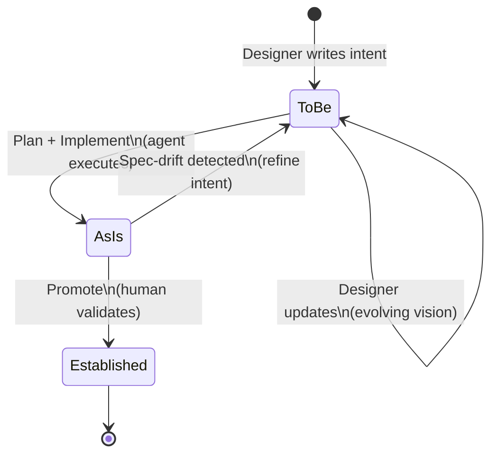

# The Design-Intent Lifecycle

## Why track design intent?

When a designer writes "I designed this dashboard for you because I know you need a quick overview of your day before diving into details," that reasoning needs to survive the journey from specification to shipped product. If it gets lost -- if the dashboard ends up showing a data dump instead of a curated overview -- the metacommunication breaks down. The user receives a different message than the one the designer intended.

SEJA tracks design intent through a three-layer model that separates what you *want* to build, what you *have* built, and what has been *validated* as correctly built. This separation makes it possible to detect drift, maintain an audit trail, and ensure that implemented features actually match their original intent.

## The three layers

### To-be: the target vision

The **to-be** layer captures the designer's current intent -- what the system should look like and why. This is the working document where designers describe features, write metacommunication statements, define user journeys, and specify the conceptual design.

Key files in this layer include the design-intent-to-be document and the metacommunication to-be document. These are **human-maintained**: the designer writes them, updates them, and owns them. Agents can read these files and propose changes, but they never modify them directly.

The to-be layer is a living document. It evolves as the designer learns more about users, refines the product vision, or responds to feedback. It is not a frozen specification -- it is the current best expression of what the designer wants to communicate through the software.

### As-is: the current implementation

The **as-is** layer reflects what actually exists in the codebase right now. After a plan is executed and code is written, the post-skill pipeline automatically updates the as-is documents to mirror the new reality. This includes the conceptual design as-is (what entities, permissions, and patterns exist), the metacommunication as-is (what designer intents have been implemented), and the journey maps as-is (which user journeys are functional).

These files are **agent-maintained**: they are updated automatically during the post-skill pipeline (see [Skills, Agents, and the Execution Pipeline](skills-agents-pipeline.md)). This automation is intentional -- the as-is layer should always reflect the true state of the implementation, not someone's memory of it.

### Established: the validated history

The **established** layer is the archive of validated intent. When a human confirms that an implemented feature correctly matches the designer's intent, the item is **promoted** from to-be/as-is status to established. This is a deliberate human act -- the designer reviews the implementation, confirms it communicates what they intended, and marks it as established.

Established files are **human-maintained and append-only for agents**. Once something is established, agents cannot alter it. This creates an immutable record of validated design decisions and their rationale.

## How intent flows through the layers

The lifecycle follows a clear progression:

1. **Designer writes to-be.** The designer captures their intent -- what they want to build, for whom, and why -- in the to-be documents. They use first-person metacommunication: "I designed this for you because..."

2. **Agent plans and implements.** Using the `/plan` and `/implement` skills, the agent reads the to-be intent and creates actionable steps. During implementation, each plan step can trace back to specific requirements in the to-be document.

3. **Post-skill updates as-is.** After implementation, the post-skill pipeline automatically updates the as-is files to reflect what changed. It adds new entities to the conceptual design, updates metacommunication records, and adjusts journey map implementation status. It also proposes IMPLEMENTED markers on the to-be items that were addressed.

4. **Human promotes to established.** The designer reviews the implementation, confirms it matches their intent, and promotes the validated items. The IMPLEMENTED marker in the to-be file is replaced with an ESTABLISHED stamp, and the corresponding entry is added to the established file.



## Lifecycle markers

SEJA uses inline markers to track where each item stands in this lifecycle:

**IMPLEMENTED marker.** When a plan is executed and the post-skill pipeline detects that a to-be item has been addressed, it proposes adding an IMPLEMENTED marker. This is an HTML comment placed before the relevant section heading:

```
<!-- STATUS: IMPLEMENTED | plan-000042 | 2026-04-01 -->
```

The marker includes the plan ID and date, creating a traceable link between the intent and the work that fulfilled it. For items implemented outside the plan workflow (manual changes), the plan ID is replaced with "manual."

**ESTABLISHED stamp.** When a human confirms promotion, the IMPLEMENTED marker is replaced (or the item is removed from to-be) and an ESTABLISHED stamp is added to the established file:

```
<!-- ESTABLISHED: plan-000042 | 2026-04-01 | v1.2.0 -->
```

The version field is optional -- projects without semantic versioning use the date alone. These markers are audit records: agents may read them and propose new IMPLEMENTED markers, but they must never remove or alter existing markers.

## Spec drift: when layers diverge

Over time, the to-be and as-is layers can drift apart. This happens naturally:

- The designer updates the to-be vision but the implementation has not caught up.
- The implementation evolves (bug fixes, refactoring) in ways that were not reflected back to the to-be documents.
- New requirements are added to to-be without removing or updating older ones that are no longer relevant.

SEJA detects this through the `/explain spec-drift` command, which compares the to-be and as-is files and produces a report of divergences. The report shows:

- **Unimplemented intent**: items in to-be that have no corresponding as-is entry.
- **Undocumented implementation**: items in as-is that have no corresponding to-be entry (features that were built without explicit design intent).
- **Misaligned details**: items that exist in both layers but differ in their specifics.

When drift is detected, the designer can choose to update the to-be (refining the vision to match reality), update the implementation (bringing code in line with intent), or promote items that are correctly aligned. The `/explain spec-drift --promote` command provides an interactive workflow for this.

## Why this matters

The three-layer model is not bureaucracy for its own sake. It solves a real problem: in any project that runs long enough, people forget *why* things were built the way they were. The established layer preserves that reasoning. The to-be/as-is comparison catches silent divergences before they become user-facing communication breakdowns.

For designers, the lifecycle provides confidence that their intent will be tracked and verified, not just read once and forgotten. For developers, it provides clear traceability from requirements to code. For teams, it creates a shared record of what was intended, what was built, and what was validated.

For more on how the pipeline that connects these layers works, see [Skills, Agents, and the Execution Pipeline](skills-agents-pipeline.md). For the review system that evaluates whether implementations communicate effectively, see [Review Perspectives and Communicability](review-perspectives-and-communicability.md).
