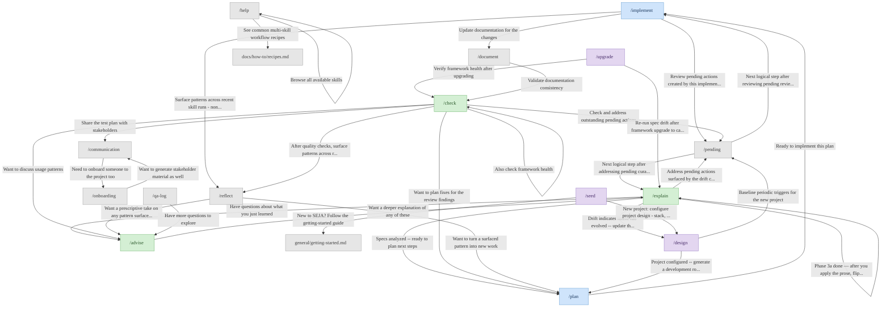

<!-- This file is generated by .claude/skills/scripts/generate_skill_map.py. Do not edit by hand. -->

# Skill map

We generated this diagram to give you a visual anchor for how SEJA skills connect. Each arrow is a "here is what we suggest next" hint we emit at the end of a skill's run, so the graph is as much a map of the workflow as it is of the code. For a text-only reader we also ship a collapsed bullet list of the same relationships below the diagram.

> If your renderer does not support mermaid, the same diagram is also available as an SVG: . We regenerate both from the same source whenever `mmdc` is on PATH.

Text-only relationship list (accessibility fallback)

- `/plan` -> `/implement`: Ready to implement this plan
- `/plan --light` -> `/implement`: Ready to implement this proposal
- `/implement` -> `/document`: Update documentation for the changes
- `/implement` -> `/pending`: Review pending actions created by this implementation
- `/implement` -> `/reflect`: Surface patterns across recent skill runs (non-prescriptive)
- `/plan --roadmap` -> `/implement`: Ready to implement items from the roadmap
- `/explain spec-drift` -> `/plan`: Specs analyzed -- ready to plan next steps
- `/explain spec-drift` -> `/design`: Drift indicates intent has evolved -- update the project design
- `/explain spec-drift` -> `/pending`: Address pending actions surfaced by the drift check
- `/pending` -> `/explain spec-drift --promote`: Next logical step after addressing pending curation items (Phase 3a generates Decision proposal)
- `/explain spec-drift --promote` -> `/explain spec-drift --promote --apply-markers plan-<id>`: Phase 3a done — after you apply the prose, flip the STATUS markers (Phase 3b)
- `/pending` -> `/implement`: Next logical step after reviewing pending review items
- `/explain` -> `/advise`: Have questions about what you just learned
- `/check review` -> `/plan`: Want to plan fixes for the review findings
- `/check validate` -> `/plan`: Found issues? Plan and fix them
- `/check validate` -> `/check health`: Also check framework health
- `/check validate` -> `/pending`: Check and address outstanding pending actions
- `/check validate` -> `/reflect`: After quality checks, surface patterns across recent runs
- `/check smoke` -> `/plan`: Found failures? Plan and fix them
- `/check health` -> `/plan`: Found issues? Plan and fix them
- `/check preflight` -> `/check review`: Want a detailed code review of the changes
- `/advise --inventory` -> `/explain`: Want a deeper explanation of any of these
- `/check telemetry` -> `/advise`: Want to discuss usage patterns
- `/check telemetry` -> `/reflect`: Surface descriptive patterns over the last 30 days
- `/reflect` -> `/advise`: Want a prescriptive take on any pattern surfaced here
- `/reflect` -> `/plan`: Want to turn a surfaced pattern into new work
- `/check test-plan` -> `/communication`: Share the test plan with stakeholders
- `/upgrade` -> `/check health`: Verify framework health after upgrading
- `/upgrade` -> `/explain spec-drift`: Re-run spec drift after framework upgrade to catch changed conventions
- `/document` -> `/check docs`: Validate documentation consistency
- `/communication` -> `/onboarding`: Need to onboard someone to the project too
- `/onboarding` -> `/communication`: Want to generate stakeholder material as well
- `/help` -> `/help --browse`: Browse all available skills
- `/help --browse` -> `docs/how-to/recipes.md`: See common multi-skill workflow recipes
- `/seed` -> `/design`: New project: configure project design (stack, conventions, domain model) after seeding
- `/seed` -> `general/getting-started.md`: New to SEJA? Follow the getting-started guide
- `/design` -> `/plan --roadmap`: Project configured -- generate a development roadmap
- `/design` -> `/plan`: Plan your first feature against the new project design
- `/design` -> `/pending`: Baseline periodic triggers for the new project
- `/qa-log` -> `/advise`: Have more questions to explore

