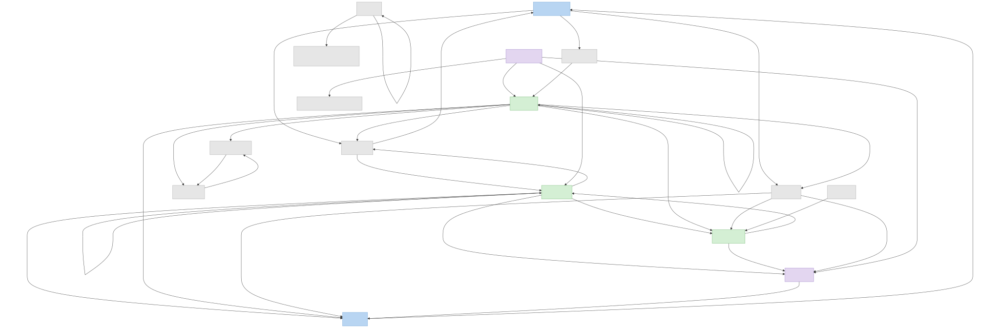

<!-- This file is generated by .claude/skills/help/generate_skill_map.py. Do not edit by hand. -->

# Skill map

We generated this diagram to give you a visual anchor for how SEJA skills connect. Each arrow is a "here is what we suggest next" hint we emit at the end of a skill's run, so the graph is as much a map of the workflow as it is of the code. For a text-only reader we also ship a collapsed bullet list of the same relationships below the diagram.

```mermaid
%%{init: {'theme': 'default', 'themeVariables': {'fontFamily': 'system-ui, -apple-system, Segoe UI, sans-serif'}}}%%
flowchart TD

    %% Planning
    implement["/implement"]
    plan["/plan"]

    %% Analysis
    check["/critique"]
    explain["/explain"]
    research["/research"]

    %% Code

    %% Utility
    communicate["/communicate"]
    document["/document"]
    help["/help"]
    onboard["/onboard"]
    pending["/pending"]
    qa_log["/qa-log"]
    reflect["/reflect"]
    docs/how_to/plan_and_execute.md["docs/how-to/plan-and-execute.md"]
    general/getting_started.md["general/getting-started.md"]

    %% Setup
    design["/design"]
    seja_setup["/seja-setup"]

    %% Relationships
    plan -->|Ready to implement this plan| implement
    implement -->|Runs automatically via post-skill step 2b for F...| document
    implement -->|Review pending actions created by this implemen...| pending
    implement -->|Surface patterns across recent skill runs - non...| reflect
    explain -->|Specs analyzed -- ready to plan next steps| plan
    explain -->|Drift indicates intent has evolved -- update th...| design
    explain -->|Decision proposal drafted -- after you apply th...| explain
    explain -->|Address pending actions surfaced by the drift c...| pending
    pending -->|Next logical step after addressing pending cura...| explain
    pending -->|Next logical step after reviewing pending revie...| implement
    research -->|Recommendations indicate the design intent shou...| design
    research -->|Want a deeper explanation of any of these| explain
    explain -->|Have questions about what you just learned| research
    check -->|Want to plan fixes for the review findings| plan
    check -->|Also check framework health| check
    check -->|Check and address outstanding pending actions| pending
    check -->|After quality checks, surface patterns across r...| reflect
    check -->|Want to discuss usage patterns| research
    reflect -->|Want an assessment and recommendations on any p...| research
    reflect -->|Want to turn a surfaced pattern into new design...| design
    reflect -->|Want to turn a surfaced pattern into new work| plan
    check -->|Share the test plan with stakeholders| communicate
    check -->|Need to onboard someone to the project| onboard
    seja_setup -->|Verify framework health after upgrading| check
    seja_setup -->|Re-run spec drift after framework upgrade to ca...| explain
    document -->|Validate documentation consistency| check
    communicate -->|Need to onboard someone to the project| onboard
    onboard -->|Want to generate stakeholder material as well| communicate
    help -->|Browse all available skills| help
    help -->|See quick-reference workflow sequences in the h...| docs/how_to/plan_and_execute.md
    seja_setup -->|New project: configure project design - stack, ...| design
    seja_setup -->|New to SEJA? Follow the getting-started guide| general/getting_started.md
    design -->|Project configured -- generate a development ro...| plan
    qa_log -->|Have more questions to explore| research

    %% Styles
    classDef planning fill:#b8d5f2,stroke:#6da3d4,color:#1e3a5f
    classDef analysis fill:#d4efd4,stroke:#74b874,color:#2d5a2d
    classDef code fill:#fce6c8,stroke:#d9a66b,color:#6b3f1e
    classDef utility fill:#e6e6e6,stroke:#a8a8a8,color:#404040
    classDef setup fill:#e3d6f0,stroke:#9b7fc7,color:#4a2f6b

    class implement,plan planning
    class check,explain,research analysis
    class communicate,document,help,onboard,pending,qa_log,reflect,docs/how_to/plan_and_execute.md,general/getting_started.md utility
    class design,seja_setup setup
```

> If your renderer does not support mermaid, the same diagram is also available as an SVG: . We regenerate both from the same source whenever `mmdc` is on PATH.

Text-only relationship list (accessibility fallback)

- `/plan` -> `/implement`: Ready to implement this plan
- `/plan --light` -> `/implement`: Ready to implement this proposal
- `/plan --roadmap` -> `/implement`: Ready to implement items from the roadmap
- `/implement` -> `/document`: Runs automatically via post-skill step 2b for FEATURE/REDESIGN plans and plans with non-N/A Docs: fields; edge stays informational for `--skip-docs` and standalone `/document` modes
- `/implement` -> `/pending`: Review pending actions created by this implementation
- `/implement` -> `/reflect`: Surface patterns across recent skill runs (non-prescriptive)
- `/explain drift` -> `/plan`: Specs analyzed -- ready to plan next steps
- `/explain drift` -> `/design`: Drift indicates intent has evolved -- update the project design
- `/explain drift --promote` -> `/explain drift --promote --apply-markers plan-<id>`: Decision proposal drafted -- after you apply the prose, flip the STATUS markers
- `/explain drift` -> `/pending`: Address pending actions surfaced by the drift check
- `/pending` -> `/explain drift --promote`: Next logical step after addressing pending curation items (generates a Decision proposal for promotion candidates)
- `/pending` -> `/implement`: Next logical step after reviewing pending review items
- `/research` -> `/design`: Recommendations indicate the design intent should change -- update the project design before planning implementation
- `/research --inventory` -> `/explain`: Want a deeper explanation of any of these
- `/explain` -> `/research`: Have questions about what you just learned
- `/critique review` -> `/plan`: Want to plan fixes for the review findings
- `/critique validate` -> `/plan`: Found issues? Plan and fix them
- `/critique validate` -> `/critique health`: Also check framework health
- `/critique validate` -> `/pending`: Check and address outstanding pending actions
- `/critique validate` -> `/reflect`: After quality checks, surface patterns across recent runs
- `/critique smoke` -> `/plan`: Found failures? Plan and fix them
- `/critique health` -> `/plan`: Found issues? Plan and fix them
- `/critique preflight` -> `/critique review`: Want a detailed code review of the changes
- `/critique telemetry` -> `/research`: Want to discuss usage patterns
- `/critique telemetry` -> `/reflect`: Surface descriptive patterns over the last 30 days
- `/reflect` -> `/research`: Want an assessment and recommendations on any pattern surfaced here
- `/reflect` -> `/design`: Want to turn a surfaced pattern into new design intents
- `/reflect` -> `/plan`: Want to turn a surfaced pattern into new work
- `/critique test-plan` -> `/communicate`: Share the test plan with stakeholders
- `/critique preflight` -> `/onboard`: Need to onboard someone to the project
- `/seja-setup --upgrade` -> `/critique health`: Verify framework health after upgrading
- `/seja-setup --upgrade` -> `/explain drift`: Re-run spec drift after framework upgrade to catch changed conventions
- `/document` -> `/critique docs`: Validate documentation consistency
- `/communicate` -> `/onboard`: Need to onboard someone to the project
- `/onboard` -> `/communicate`: Want to generate stakeholder material as well
- `/help` -> `/help --browse`: Browse all available skills
- `/help --browse` -> `docs/how-to/plan-and-execute.md`: See quick-reference workflow sequences in the how-to guides
- `/seja-setup` -> `/design`: New project: configure project design (stack, conventions, domain model) after setup
- `/seja-setup` -> `general/getting-started.md`: New to SEJA? Follow the getting-started guide
- `/design` -> `/plan --roadmap`: Project configured -- generate a development roadmap
- `/design` -> `/plan`: Plan your first feature against the new project design
- `/qa-log` -> `/research`: Have more questions to explore

