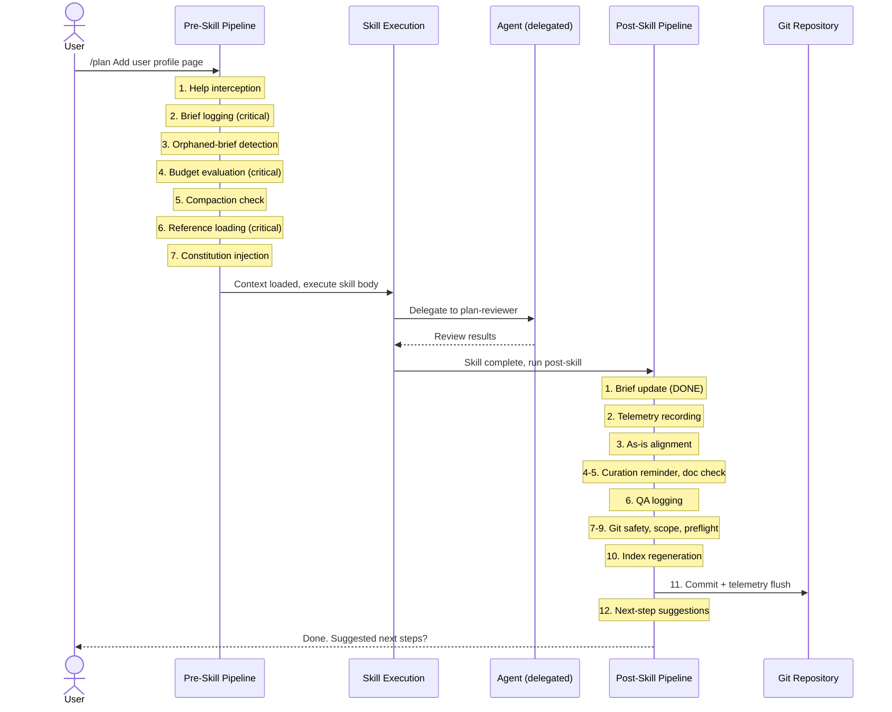

# Skills, Agents, and the Execution Pipeline

## Overview

SEJA organizes its capabilities into **skills** (what you invoke), **agents** (what does the specialized work), and a **pipeline** (what runs before and after every skill). Together, these three components ensure that every action -- planning a feature, reviewing code, generating documentation -- follows a consistent, governed process.

## What are skills?

Skills are slash commands you type in Claude Code. When you type `/plan Add user profile page`, you are invoking the `plan` skill. Each skill is defined by a `SKILL.md` file that contains:

- **YAML frontmatter** with metadata: the skill's name, description, context budget tier, which reference files it needs, and which pipeline stages it can skip. This frontmatter follows the [agentskills.io](https://agentskills.io) specification for portable agent skill definitions.
- **A body** with the skill's execution instructions: what to do, in what order, and how to handle edge cases.
- **A Quick Guide** section with a plain-language description, example usage, and a scenario showing when the skill is useful.

SEJA includes 13 user-facing skills and 2 internal lifecycle hooks:

| Category | Skills |
|----------|--------|
| Design | `/design`, `/seed` |
| Planning | `/plan` (standard, light, and roadmap modes) |
| Implementation | `/implement` |
| Review and quality | `/check` (9 modes: validate, review, smoke, preflight, health, and others), `/advise` |
| Understanding | `/explain` (behavior, code, data model, architecture, spec-drift) |
| Communication | `/communication`, `/onboarding`, `/document` |
| Maintenance | `/upgrade` |
| Utility | `/help`, `/qa-log` |

The two internal hooks -- `/pre-skill` and `/post-skill` -- are not invoked directly. They run automatically as part of every skill invocation, forming the pipeline described below.

## What are agents?

Agents are specialized subprocesses that skills delegate to when they need focused expertise. While a skill handles the overall workflow (argument parsing, user interaction, lifecycle hooks), an agent handles a specific type of work in an isolated context window.

SEJA has 10 agents organized into three roles:

**Evaluator agents (7)** review artifacts against quality criteria:
- **code-reviewer** -- reviews code diffs for quality, security, and standards compliance
- **plan-reviewer** -- reviews plans for completeness, feasibility, and perspective coverage
- **advisory-reviewer** -- reviews design decisions and architectural choices
- **council-debate** -- runs structured multi-perspective debates on contentious decisions
- **standards-checker** -- aggregates results from validation scripts
- **test-runner** -- executes and evaluates test suites
- **migration-validator** -- validates database migrations for safety and compatibility

**Generator agents (3)** produce artifacts from well-defined inputs:
- **communication-generator** -- creates tailored stakeholder material for different audiences
- **onboarding-generator** -- builds personalized onboarding plans based on role and expertise level
- **document-generator** -- generates or updates project documentation

**Executor agents** (a pattern, not standalone files) execute individual plan steps in isolated context windows. The `/implement` skill constructs their prompts dynamically from plan step metadata. In auto mode, a bounded generator-critic loop (maximum 2 retries) lets the code-reviewer catch critical issues before moving to the next step.

Each agent follows a single-responsibility principle: it operates on one type of artifact through one lens. This keeps each agent focused and predictable.

## The execution pipeline

Every skill invocation passes through a three-phase pipeline: pre-skill, skill execution, and post-skill. Here is what happens when you type a command like `/plan Add user profile page`:

### Phase 1: Pre-skill (7 stages)

The pre-skill pipeline prepares the execution context. It runs 7 stages, 3 of which are critical (always run) and 4 of which are non-critical (error-isolated, individually skippable via the skill's frontmatter):

1. **Help interception** (non-critical) -- Checks if you passed `--help`. If so, displays the skill's Quick Guide and stops.

2. **Brief logging** (critical) -- Records the invocation in the project's briefs log with a timestamp and your description. This creates an audit trail and helps detect orphaned (crashed) sessions.

3. **Orphaned-brief detection** (non-critical) -- Scans the briefs index for STARTED entries that were never completed. These may indicate crashed sessions from previous work.

4. **Budget evaluation** (critical) -- Determines how much context to load based on the skill's declared budget tier (light, standard, or heavy). See [Context Budget and References](context-budget-and-references.md) for details on how this works.

5. **Compaction check** (non-critical) -- Warns you if you have run 8 or more skills in the current session, suggesting you start a fresh conversation to avoid context degradation.

6. **Reference loading** (critical) -- Loads the project's conventions, permissions, constraints, and any skill-specific reference files. Supports both eager loading (upfront) and lazy loading (on demand).

7. **Constitution injection** (non-critical) -- Loads the project's constitution (immutable design principles) if one exists.

Non-critical stages are wrapped in error isolation: if one fails, a warning is logged and the pipeline continues. Critical stages abort the pipeline on failure.

### Phase 2: Skill execution

The skill's body instructions run with the loaded context. This is where the actual work happens -- creating a plan, reviewing code, generating documentation, or whatever the skill does.

During execution, skills may delegate to agents. For example, `/plan` delegates to the plan-reviewer agent for quality review, and `/implement` delegates to executor agents for each plan step.

### Phase 3: Post-skill (11 steps)

After the skill completes, the post-skill pipeline handles cleanup, record-keeping, and governance:

1. **Brief update** -- Marks the brief entry as DONE with a completion timestamp.
2. **Telemetry recording** -- Prepares a structured telemetry record (skill name, duration, outcome, context budget).
3. **As-is alignment** -- If a plan was executed, updates the as-is files (conceptual design, metacommunication, journey maps) to reflect what changed. Proposes IMPLEMENTED markers on to-be items. See [The Design-Intent Lifecycle](design-intent-lifecycle.md).
4. **Design intent curation reminder** -- Reminds the designer to review and promote implemented items.
5. **Documentation check** -- If the plan identified documentation needs, offers to run `/document`.
6. **QA logging** -- Saves the full question-and-answer session for future reference.
7. **Git safety check** -- Verifies the repository is in a clean state for committing.
8. **Commit scope verification** -- Ensures only expected files are staged.
9. **Fast preflight gate** -- Runs quick validation checks before committing.
10. **Index regeneration** -- Updates the briefs index and global artifact index.
11. **Git commit and telemetry flush** -- Commits the changes and writes the telemetry record.
12. **Next-step suggestions** -- Based on a skill graph, suggests what you might want to do next and lets you select directly.

### Pipeline flow

Text description of this diagram

1. The **User** sends a command (e.g., `/plan Add user profile page`) to the **Pre-Skill Pipeline**.
2. The Pre-Skill Pipeline runs 7 stages: help interception, brief logging (critical), orphaned-brief detection, budget evaluation (critical), compaction check, reference loading (critical), and constitution injection.
3. The Pre-Skill Pipeline passes the loaded context to **Skill Execution**.
4. Skill Execution delegates specialized work to an **Agent** (e.g., plan-reviewer) and receives review results back.
5. Skill Execution passes control to the **Post-Skill Pipeline**.
6. The Post-Skill Pipeline runs 12 steps: brief update (DONE), telemetry recording, as-is alignment, curation reminder and doc check, QA logging, git safety and scope and preflight checks, and index regeneration.
7. Post-skill commits changes and flushes telemetry to the **Git Repository**.
8. Post-skill suggests next steps to the **User**.

## How it all connects

The pipeline ensures that every skill invocation -- whether it is a quick `/advise` question or a multi-step `/implement` execution -- follows the same lifecycle:

- **Before**: context is loaded, budgets are checked, the project's rules are injected.
- **During**: the skill does its work, delegating to specialized agents as needed.
- **After**: records are updated, implementation state is aligned, changes are committed, and the next step is suggested.

This consistency means you do not need to remember to update briefs, check for spec drift, or commit your changes. The pipeline handles it. You focus on the design and development work; SEJA handles the governance.

For more on how the context budget system works, see [Context Budget and References](context-budget-and-references.md). For the review perspectives that agents apply during evaluation, see [Review Perspectives and Communicability](review-perspectives-and-communicability.md).
