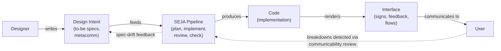

# What Is SEJA and Why Does It Exist?

## The core idea: software is communication

Most development tools treat software as a technical artifact -- something to build, test, and deploy. SEJA starts from a different premise, borrowed from a theory of human-computer interaction called **semiotic engineering**: software is a message from its designers to its users.

Every interface element, every workflow, every error message is part of a conversation. The designer is saying: "I designed this for you because I understand who you are, what you need to do, and why. Here is how I think you should do it." This ongoing message -- delivered not in words but through the system itself -- is called **metacommunication**.

When you tap a button, read a label, or recover from an error, you are interpreting the designer's intent. Good software makes that intent clear. Bad software leaves you guessing -- "Where is it?", "What happened?", "Why doesn't it work?" These are not just usability problems. They are communication breakdowns between a designer (who is absent) and a user (who is present).

## The problem SEJA solves

In practice, designer intent gets lost. A product designer writes a specification. A developer interprets it, makes trade-offs, and writes code. The code gets reviewed, tested, and shipped. At each step, some of the original "I designed this for you because..." reasoning evaporates. By the time the user sees the interface, the metacommunication may be garbled or missing entirely.

This is not anyone's fault. It is a structural problem. Design intent lives in documents, conversations, and people's heads. Code lives in repositories. There is no standard pipeline that tracks how meaning transforms from conception to implementation and verifies that the designer's message actually reaches the user intact.

SEJA bridges that gap. It provides a structured pipeline -- running inside Claude Code -- that:

1. **Captures design intent explicitly**, using first-person metacommunication ("I designed this search filter for you because I know you manage hundreds of items and need to narrow results quickly").
2. **Carries that intent through planning and implementation**, so every plan step and code change can be traced back to the designer's reasoning.
3. **Verifies alignment after implementation**, by comparing what the designer intended (the "to-be" state) with what the code actually delivers (the "as-is" state) and flagging drift.
4. **Reviews from multiple perspectives**, applying 16 specialized lenses -- from security to accessibility to user experience -- to check whether the metacommunication survives the pipeline.

## What metacommunication looks like in practice

In SEJA, metacommunication is not abstract theory. It is a concrete artifact: a document written in first person, addressed to the user in second person.

Instead of writing "The system provides a postpone shortcut," a designer using SEJA writes: "I designed a postpone shortcut for you because I know you tend to over-schedule, and I want to give you a low-friction way to push tasks without losing your planning momentum."

This phrasing rule is non-negotiable in the framework. It forces the designer to articulate not just *what* they built, but *who* they built it for and *why*. That reasoning then travels through the entire pipeline -- from design intent documents, through plans, into implementation, and back into post-implementation alignment checks.

The framework maintains three layers of design intent to track how this message evolves over time. See [The Design-Intent Lifecycle](design-intent-lifecycle.md) for details.

## How SEJA differs from generic coding assistants

Many AI coding tools help you write code faster. SEJA is not primarily a code-generation tool. It is a **design-aware development framework** that uses AI agents to maintain the integrity of designer-to-user communication throughout the software lifecycle.

Here is what makes it different:

- **Theory-grounded, not ad hoc.** SEJA's architecture maps directly to semiotic engineering concepts. Review questions come from the Communicability Evaluation Method (CEM), a research-validated taxonomy of 13 communicative breakdown types. API reviews use Cognitive Dimensions of Notations (CDN), a framework for evaluating how well a notation system supports its users. These are not checklists invented for convenience -- they are tools refined over decades of HCI research.

- **Multi-perspective review.** Instead of a single "code review" pass, SEJA applies 16 review perspectives organized into engineering concerns (security, performance, database design, and 8 others) and design concerns (user experience, accessibility, visual design, responsive design, microinteractions). Each perspective has priority-classified questions, and conflicts between perspectives follow explicit resolution rules. See [Review Perspectives and Communicability](review-perspectives-and-communicability.md) for more.

- **Design intent as a first-class artifact.** Generic tools treat specifications as input and code as output. SEJA treats the *relationship* between them as the thing to manage. It detects when implementation drifts from intent, proposes alignment, and maintains an audit trail of what was intended, what was built, and what was validated.

- **Structured execution pipeline.** Every skill invocation passes through a pre-skill pipeline (loading context, checking budgets, injecting project constraints) and a post-skill pipeline (updating implementation records, logging quality assurance, committing changes). This ensures consistent governance without requiring the user to remember checklists. See [Skills, Agents, and the Execution Pipeline](skills-agents-pipeline.md) for the full flow.

## The designer-to-user communication model

The following diagram shows how SEJA fits into the flow of communication from designer to user:

The solid arrows show the forward flow: the designer's intent enters the pipeline, becomes code, becomes an interface, and reaches the user. The dashed arrows show the feedback loops: communicability review detects where the user might misunderstand the interface, and spec-drift detection catches where the implementation diverges from the intent.

SEJA's goal is to keep this chain intact -- so that when a user interacts with the finished product, they receive the message the designer intended to send.

## Who SEJA is for

SEJA is built for teams where design intent matters -- where "it works" is not enough and "it communicates what we intended" is the real bar. It is especially useful when:

- Designers and developers collaborate on the same codebase but think in different vocabularies.
- Projects need to maintain alignment between specifications and implementation over time.
- Teams want structured, repeatable review processes rather than ad hoc code review.
- AI-assisted development needs guardrails to preserve human design reasoning.

Whether you are a product designer writing metacommunication statements or a developer executing plans, SEJA gives you a shared framework for making sure the software says what you meant it to say.

For a practical walkthrough of SEJA's commands and components, see [Skills, Agents, and the Execution Pipeline](skills-agents-pipeline.md). For an overview of how design intent is tracked over time, see [The Design-Intent Lifecycle](design-intent-lifecycle.md).
