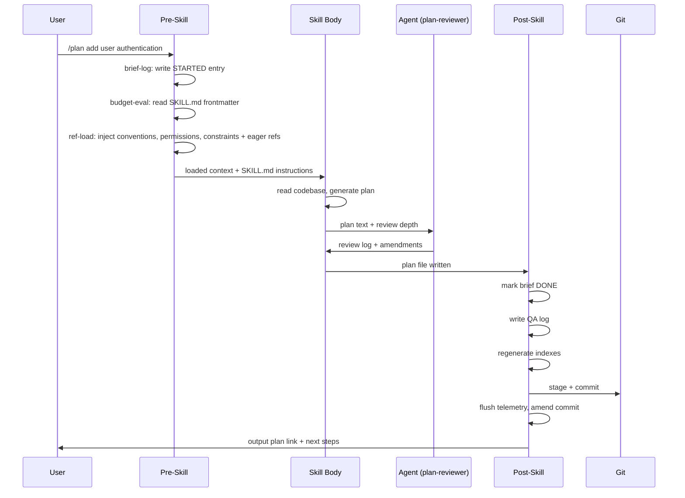

# SEJA Internals Walkthrough

**Tracing a skill invocation from command to commit**

This walkthrough traces a single skill invocation from the moment you type a command to the final git commit. By the end, you will understand exactly what files are read, what context is assembled, and what happens at each stage. Assumes familiarity with CLI, git, and agent concepts.

---



<details>
<summary>Text description of this diagram</summary>

1. The user sends `/plan add user authentication` to the pre-skill phase.
2. Pre-skill logs a STARTED brief entry, reads the skill's YAML frontmatter for budget evaluation, and loads mandatory references plus eager references.
3. Pre-skill passes the loaded context and SKILL.md instructions to the skill body.
4. The skill body reads the codebase and generates a plan.
5. The skill body delegates the plan text to the plan-reviewer agent for review.
6. The plan-reviewer agent returns a review log with amendments.
7. The skill body passes the written plan file to the post-skill phase.
8. Post-skill marks the brief as DONE, writes a QA log, regenerates indexes, stages and commits to git, flushes telemetry (amending the commit), and outputs the plan link with next-step suggestions to the user.

</details>

---

## 1. The command

You type:

```
/plan add user authentication
```

Claude Code recognizes `/plan` as a skill invocation. It locates the skill definition at `.claude/skills/plan/SKILL.md` and begins the pre-skill pipeline defined in `.claude/skills/pre-skill/SKILL.md`.

The text after the skill name -- `add user authentication` -- becomes the **brief**. This brief is the single-line description that follows the skill through every stage: logging, execution, QA, and the git commit message.

---

## 2. Pre-skill pipeline

The pre-skill pipeline has 7 stages. Each stage is either **critical** (aborts on failure) or **non-critical** (logs a warning and continues). We trace them in order.

### Stage 1: help (non-critical)

If the brief is `--help` or empty with a `?` flag, pre-skill short-circuits to display skill help and exits. Our brief is `add user authentication`, so this stage is a no-op.

### Stage 2: brief-log (critical)

Runs `date -u` to capture the current UTC time, then appends a STARTED entry to `_output/briefs.md`:

```
STARTED | 2026-04-07 01:00 UTC | plan | add user authentication
```

This write happens immediately, before any other work. If the process crashes mid-skill, the orphaned STARTED entry will be detected on the next invocation. Because brief-log is critical, a failure here (e.g., file locked, disk full) aborts the entire skill -- no partial state is created.

### Stage 3: orphan-check (non-critical)

Reads `_output/briefs-index.md` and scans for STARTED entries that have no matching DONE. If orphans are found:

```
Warning: 2 orphaned STARTED entries found
```

This is informational. The skill proceeds regardless. A skill can opt out via `metadata.skip_stages: [orphan-check]` in its SKILL.md frontmatter.

### Stage 4: budget-eval (critical)

Reads the YAML frontmatter from the skill's SKILL.md:

```yaml
metadata:
  context_budget: standard
  eager_references:
    - project/conceptual-design-as-is.md
  references:
    - project/conceptual-design-as-is.md
    - project/design-intent-to-be.md
    - general/shared-definitions.md
    - general/review-perspectives.md
```

The `context_budget` field determines how much context to load:

| Tier | Briefs loaded | Reference depth |
|------|---------------|-----------------|
| `light` | None | Mandatory refs only |
| `standard` | Index only (not full briefs) | Mandatory + eager refs |
| `heavy` | Full briefs file | All refs |

For our `standard` tier, the briefs index is loaded but not the full briefs file. The stage then proceeds to ref-load.

### Stage 5: compaction-check (non-critical)

Checks whether the conversation context is approaching capacity. If so, logs a compaction hint. For a fresh invocation this is a no-op.

### Stage 6: ref-load (critical)

This stage assembles the reference context. It always loads three **mandatory references**:

- `_references/general/conventions.md`
- `_references/general/permissions.md`
- `_references/general/constraints.md`

Then it loads **eager references** declared in the frontmatter. For `/plan`, that is:

- `_references/project/conceptual-design-as-is.md`

The remaining references are listed as **lazy** -- available but not loaded upfront:

```
--- Available references (load when needed) ---
1. project/design-intent-to-be.md -- load before metacomm framing
2. general/shared-definitions.md -- load before resolving terminology
3. general/review-perspectives.md -- load before evaluating perspectives
To load: read and inject the file from _references/<path>.
---
```

Lazy references keep context lean. The skill body can load them on demand when it reaches a point where they are needed.

### Stage 7: constitution (non-critical)

Reads `_references/project/constitution.md` if it exists. This file contains immutable project principles -- constraints that no skill may override. The constitution is injected into context so it governs all downstream decisions.

If the file does not exist, this stage silently skips.

---

## 3. Skill body execution

With the pre-skill pipeline complete, control passes to the skill body. The skill body receives:

- All loaded references (mandatory + eager)
- The lazy reference listing
- The SKILL.md instructions
- The user's brief

For `/plan`, the skill body performs these steps:

1. **Parse the brief**: `add user authentication` -- this is the problem statement.
2. **Reserve a global ID**: Runs `python reserve_id.py --type plan --title 'add user authentication'`, which returns `000048`. This ID is unique across all artifact types (plans, QA logs, designs).
3. **Read the codebase**: The skill reads relevant source files to understand the existing architecture, models, and patterns.
4. **Generate the plan**: Produces a structured plan document with:
   - User Brief (the original command)
   - Agent Interpretation (problem statement + approach)
   - Steps with file paths, verify conditions, and implementation notes
   - Docs, Risk, and Depends fields
5. **Write the plan file**: Saves to `_output/plans/plan-000048-add-user-authentication.md`.

---

## 4. Agent delegation

The plan skill does not review its own output. Instead, it delegates to the **plan-reviewer** agent.

### How delegation works

1. The skill constructs a prompt containing:
   - The full plan text
   - The plan file path
   - The review depth (`standard` -- derived from the skill's context budget)
2. Launches the agent via the `Agent tool` with `subagent_type=plan-reviewer`.
3. The agent loads its own context from `.claude/agents/plan-reviewer.md`, which defines:
   - What perspectives to evaluate (security, database, performance, etc.)
   - How to score and classify findings
   - When to adopt vs. defer a finding

### What the agent returns

The plan-reviewer returns a **review log** structured as a table:

| Perspective | Status | Finding |
|---|---|---|
| SEC | Adopted | Password hashing uses bcrypt with cost factor 12 |
| DB | Adopted | Migration includes rollback step |
| PERF | Deferred | Token expiry check could use caching -- low priority |

Each finding is either **Adopted** (the plan is amended to address it) or **Deferred** (logged but not acted on). The skill appends this review log to the plan file.

If the reviewer finds **critical issues**, it enters an iteration loop (max 3 rounds). Each iteration amends the plan and re-evaluates affected perspectives. If issues remain unresolved after 3 iterations, they are logged as Deferred with an explanation.

---

## 5. Post-skill pipeline

Once the skill body completes, the post-skill pipeline runs 13 steps. We trace the key ones.

### Step 1 -- DONE marker

Updates `_output/briefs.md` with a DONE entry that references the original STARTED entry:

```
DONE | 2026-04-07 01:15 UTC | STARTED | 2026-04-07 01:00 UTC | plan | add user authentication | PLAN | 000048
```

The format links DONE to STARTED via the original timestamp, and tags the artifact type (`PLAN`) and ID (`000048`).

### Step 1b -- Telemetry record prepared

A telemetry record is prepared in memory:

```json
{
  "timestamp": "2026-04-07T01:15:00Z",
  "skill": "plan",
  "id": "000048",
  "duration_seconds": 900,
  "outcome": "success",
  "brief": "add user authentication",
  "prefix_scope": "FEATURE-X",
  "plan_id": null,
  "error_type": null,
  "output_file": "_output/plans/plan-000048-add-user-authentication.md",
  "context_budget": "standard"
}
```

This record is not yet flushed -- it waits for the git commit SHA.

### Step 3 -- QA log

Writes a QA log to `_output/qa-logs/plan-000048-qa-add-user-authentication.md`. The QA log captures:

- What the skill was asked to do
- What it produced
- Verification status
- Any warnings or deferred findings from the review

### Step 5 -- As-is alignment check

Compares the plan output against `_references/project/conceptual-design-as-is.md` to detect drift. If the plan introduces changes that conflict with the current design, a warning is logged.

### Step 6b -- Fast preflight gate

Runs `run_preflight_fast.py`, which executes 9 automated checks:

- Version/changelog sync
- Briefs format validation
- Skill system integrity
- Plan coverage
- Design output consistency
- Vulnerability pattern scan
- And others

If any check fails, post-skill halts before committing. The failure is reported so you can fix it before retrying.

### Step 7 -- Index regeneration

Regenerates two index files to reflect the new artifact:

- `generate_briefs_index.py` -- rebuilds `_output/briefs-index.md` from `_output/briefs.md`
- `generate_macro_index.py` -- rebuilds `_output/macro-index.md` from all artifacts

### Step 8 -- Git commit

Stages all changed files and commits with a conventional message:

```
plan-000048: add user authentication
```

The commit message format is always `<type>-<id>: <brief>`.

### Step 8b -- Telemetry flush

Now that a commit SHA exists, the telemetry record is completed:

```json
{
  "git_commit_sha": "a1b2c3d",
  "files_changed": 4,
  "parent_skill": null
}
```

These fields are added to the prepared record, which is appended to `_output/telemetry.jsonl`. The commit is amended to include the telemetry file.

### Steps 9-13 -- Wrap-up

- **Step 9**: Flush any remaining telemetry
- **Step 10**: As-is alignment (final pass)
- **Step 11**: Suggest next steps to the user (e.g., "Run `/implement 000048` to execute this plan")
- **Step 12**: Clean up temporary state
- **Step 13**: Return the plan link and next-step suggestions

---

## 6. The artifact

The final plan file at `_output/plans/plan-000048-add-user-authentication.md` looks like this (abbreviated):

```markdown
# Plan 000048 | FEATURE-X | 2026-04-07 01:00 UTC | Add user authentication | Review: Standard
plan_format_version: 1

## User Brief
add user authentication

## Agent Interpretation
1. Problem: The application has no authentication mechanism. Users can
   access all routes without identity verification.
2. Approach: Implement session-based authentication with bcrypt password
   hashing, login/logout endpoints, and middleware for protected routes.

## Steps
### Step 1: Create auth model and migration
- Files: src/models/user.py, migrations/003_add_users.sql
- Verify: migration runs forward and backward without error
- [x] Done

### Step 2: Add login and logout endpoints
- Files: src/routes/auth.py, src/middleware/auth.py
- Verify: POST /login returns 200 with valid credentials, 401 otherwise
- [ ] Pending

## Review Log
| Perspective | Status | Finding |
|---|---|---|
| SEC | Adopted | Password hashing uses bcrypt with cost factor 12 |
| DB | Adopted | Migration includes rollback step |
| PERF | Deferred | Token expiry check could use caching -- low priority |
```

This file is the single source of truth for the change. It is version-controlled, referenced by its ID in briefs, QA logs, and telemetry, and can be executed later with `/implement 000048`.

---

## 7. What would happen if...

### ...a reference file was missing?

The ref-load stage logs a warning and continues -- it is non-critical for missing optional references. The skill body may later fail if it depends on the missing reference content, but the pipeline itself does not abort. Mandatory references (conventions, permissions, constraints) are an exception: if one of these is missing, ref-load raises a warning but still proceeds, since the files may not yet exist in a new project.

### ...the briefs file was locked?

The brief-log stage is **critical**. If it cannot write to `_output/briefs.md` (locked file, permission error, disk full), pre-skill aborts immediately. The skill does not execute. No partial state is created. You will see an error message and can retry after resolving the lock.

### ...post-skill crashed at step 5?

Post-skill uses a checkpoint mechanism. After completing each step, it writes a checkpoint to `.post-skill-checkpoint`:

```
3 | 2026-04-07 01:10 UTC | 000048
```

On the next invocation, post-skill reads this checkpoint and resumes from step 4. This makes post-skill **idempotent** -- re-running it will not duplicate DONE entries, QA logs, or commits. The checkpoint file is cleaned up after a successful full run.

### ...the plan-reviewer found critical issues?

The review enters an **iteration loop** with a maximum of 3 rounds. In each round:

1. The reviewer identifies critical issues in the current plan.
2. The skill amends the plan to address those issues.
3. The reviewer re-evaluates only the affected perspectives.

If all critical issues are resolved, the loop exits. If issues remain after 3 iterations, they are logged as **Deferred** with an explanation of why they could not be resolved automatically. The plan is still saved -- it is not discarded -- but the deferred items are visible in the review log for human follow-up.

---

## Going deeper

- [Framework File Map](../architecture/framework-file-map.md) -- what each directory and file category does
- [Skill Execution Pipeline](../architecture/skill-execution-pipeline.md) -- the full pre-skill, skill, post-skill lifecycle
- [Context Strategy](../architecture/context-strategy.md) -- how the framework manages LLM context constraints
- [Extension Guide](../architecture/extension-guide.md) -- step-by-step instructions for adding skills, perspectives, agents, rules
